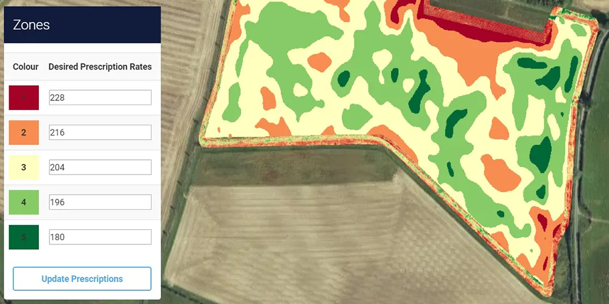

```{r}
library(data.table)
library(here)
library(knitr)
library(dplyr)
library(flextable)
```

# What is econometrics about?

<html><div style='float:left'></div><hr color='#EB811B' size=1px width=1000px></html>

## What econometrics is about

::: {.panel-tabset}

### What?

<details class="transcript">
<summary>Lecturer transcript</summary>

Let's start with the simplest possible answer to the question, what is econometrics? We estimate quantitative relationships between variables. Notice the word quantitative. We are not satisfied with saying fertilizer helps yield; we want a number, in bushels per additional pound of nitrogen. Look at the three examples on the screen. Every one of them has the same shape: something you could change, and something you care about. Fertilizer and yield, campaign spending and votes, education and wages. That shape is going to follow you through the entire course. And notice that all three are questions somebody would pay money to have answered, which is really why this field exists at all.

</details>

**What are we doing?**

Estimate quantitative relationships between variables.

<br>

**Examples**

+ the impact of fertilizer on crop yield
+ the impact of political campaign expenditure on voting outcomes
+ the impact of education on wage

### Steps in Econometric Analysis

<details class="transcript">
<summary>Lecturer transcript</summary>

Here is the whole workflow of an empirical project, start to finish. I want you to notice two things about this list. First, how much of it happens before any estimation: you formulate a question, you build an economic model of what is going on, you turn that into an econometric model, and only then do you collect data. Four steps of thinking before a single number gets computed. Second, notice that only the last two, the ones in blue, are what this course is about. That is not because the first four matter less. They matter enormously. It is that they are much harder to teach, and much easier to do badly.

</details>

1. formulation of the question of interest (what are you trying to find out?)
2. develop an economic model of the phenomenon you are interested in understanding (identify variables that matter)
3. turn the economic model into an econometric model
4. collect data
5. <span style = "color: blue;"> estimate the model using econometrics </span>
6. <span style = "color: blue;"> test hypotheses </span>

:::
<!--end of panel-->


## Go through the steps

::: {.panel-tabset}
### Step 2: Economic Model

<details class="transcript">
<summary>Lecturer transcript</summary>

We will walk through those steps with one concrete example: does job training actually make workers more productive? Step two says write down an economic model, and here it is. Wage is some function f of education, experience, and training. That is all an economic model is at this stage, a claim about which things belong on the list. Notice what it does not say. It does not say how much each one matters, or even whether more education means a higher wage. It only names the variables you think are in play. And read the note at the bottom, because this list is deliberately short so we can follow it. A real paper's model would be far more involved.

</details>

**Example: Job training and worker productivity**

$$wage = f(educ,exper,training)$$

+ $wage$: hourly wage
+ $educ$: years of formal education
+ $exper$: years of workforce experience
+ $training$: weeks spent in job training

**Note**

Depending on questions you would like to answer, the economic model can (and should) be much more involved

### Step 3: Econometric model

<details class="transcript">
<summary>Lecturer transcript</summary>

Step three is where the model becomes something you can actually estimate, and it takes one big decision: you have to pick a form for that function f. Almost always we start by assuming it is linear, which gives you the equation on screen. Wage equals beta-zero, plus beta-one times education, plus beta-two times experience, plus beta-three times training, plus u. The betas are the parameters, and they are what you are after: each one answers how much wage moves when that variable moves. Now look hard at the u on the end. That is the error term, and it holds every other thing that affects a wage. Innate ability, luck, who your parents know. Remember it. It is where all our trouble comes from.

</details>

We have built a conceptual model:

$$wage = f(educ,exper,training)$$

Now, the form of the function $f(\cdot)$ must be specified (almost always) before we can undertake an econometric analysis

$$
wage = \beta_0 + \beta_1 educ + \beta_2 exper + \beta_3 training + u
$$

**$\beta_0,\beta_1,\beta_2,\beta_3$**

+ are the <span style = "color: red;"> parameters </span> of the econometric model.
+ describe the directions and strengths of the relationship between $wage$ and the factors used to determine $wage$ in the model

**$u$**

+ is called error term
+ includes <span style = "color: red;"> ALL </span> the other factors that can affect wage other than the included variables (like innate ability)

### Step 4: Collect data

We can collect data using various ways. Some of them include survey, websites, experiments. Let's look at different data types:

::: {.panel-tabset}
#### Cross-sectional Data

<details class="transcript">
<summary>Lecturer transcript</summary>

Step four is data, and the kind of data you have decides which methods are even available to you, so it is worth naming the three types. This first one, cross-sectional, is a snapshot: many different units, people or farms or firms or counties, each observed once, at roughly one point in time. I say roughly because, as the second bullet points out, some of these families were surveyed in different weeks of the year. Look at the table below, which is real wage data in R. Each row is one worker; the columns are that worker's wage, education, experience, and so on. There is no time dimension at all. Most of this course assumes data that looks exactly like this.

</details>

+ Sample of individuals, households, firms, cities, states, countries, or a variety of other units, taken at a given point in time
+ The data on all units do not correspond to precisely the same time period
  - some families surveyed during different weeks within a year

**What a cross-sectional data looks like on R**

```{r }
#| echo: false
data(wage1, package = "wooldridge") 

data.table(wage1) %>%
  .[, .(wage, educ, exper, female, married)]
```

#### Time-series Data

<details class="transcript">
<summary>Lecturer transcript</summary>

The second type is the mirror image: one unit, followed over time. The price of corn every month for thirty years, or the price of oil. Instead of many people once, it is one series many times. And I want to be upfront about the note in red. We are not going to teach time series methods in this course. That is not a slight on them. It is that observations sitting next to each other in time are related to each other in ways that break most of the assumptions we are about to make, and repairing that properly takes a course of its own. If your own research turns out to be time series, come and talk to me about where to learn it.

</details>

Observations on a variable or several variables over time
  + corn price
  + oil price

<br>

**Note**

+ The econometric frameworks necessary to analyze time series data are quite different from those for cross-sectional data
+ We do <span style = "color: red;"> NOT </span> learn time-series econometric methods

#### Panel (Longitudinal) Data

<details class="transcript">
<summary>Lecturer transcript</summary>

The third type combines the other two, and it is the most valuable of the three. Panel data means you follow the same units over time: the same people surveyed every five years, the same sixty countries every year. Look at the table. The first two columns are county and year, and you will see the same county appear again and again with a different year each time. That repetition is the signature of panel data. The reason to care, and it will matter enormously in lecture ten, is that when you observe the same county twice, anything about that county that does not change can be differenced away, even if you never got to measure it.

</details>

Time series data for each cross-sectional member in the data set (<span style = "color: red;"> same </span> cross-sectional units are tracked over a given period of time)

**Example**

+ wage data for individuals collected every five years over the past 30 years
+ yearly GDP data for 60 countries over the past 10 years

**What a panel data looks like on R**

```{r }
#| echo: false
data(crime4, package = "wooldridge") 
data.table(crime4)[, .(county, year, crmrte, prbarr, prbpris)]
```


:::
<!--end of panel-->

### Steps 5 and 6

<details class="transcript">
<summary>Lecturer transcript</summary>

And steps five and six, estimating the model and testing hypotheses, are the rest of your semester. I am putting them on a slide by themselves partly as a joke and partly not. Everything we just walked through, steps one through four, is the part where you have to think like an economist. Steps five and six are the part with the mathematics in it, and that is the part I can genuinely teach you in fifteen weeks. But keep the proportions in mind. A beautifully estimated model of a badly posed question is worth nothing at all, and none of the tools we are about to give you will warn you when that is what you have built.

</details>

This is what you learn for the next few months!!

  + estimate the model using econometrics
  + test hypotheses

:::
<!--end of panel-->

# Causality and Association

<html><div style='float:left'></div><hr color='#EB811B' size=1px width=1200px></html>

## Causality and Association

::: {.panel-tabset}

### Distinction between causality and association

<details class="transcript">
<summary>Lecturer transcript</summary>

This is the most important slide in the lecture, so let's slow down. Look at the four arrow diagrams. A affects B. B affects A. They affect each other. And the last one, C affects both A and B, with no arrow between A and B at all. In every one of those four cases, A and B move together. A correlation coefficient cannot tell them apart; it hands you the same number for all four. That is what association means, and that is all it means. Causality is only the first diagram. Now read the note about that fourth case: A and B are associated even though neither one affects the other. That case is the source of nearly every headache in this course.

</details>

**Association**

An association between two variables can arise for <span style = "color: red;"> several different reasons </span>

```{=tex}
\begin{align}
  A & \longrightarrow B && \mbox{(A affects B)}\\
  A & \longleftarrow B && \mbox{(B affects A)}\\
  A & \longleftrightarrow B && \mbox{(A and B affect each other)}\\
  A & \longleftarrow C \longrightarrow B && \mbox{(C affects both A and B)}
\end{align}
```

Association does <span style = "color: red;"> NOT </span> concern which affects which. Under all the four cases above, A and B are <span style = "color: blue;"> associated</span>. Or, we say there is an association between A and B. This is what <span style = "color: blue;"> correlation coefficient </span> measures.

:::{.callout-note}
Pay attention to the last case: A and B are associated even though <span style = "color: red;"> neither of them affects the other </span> at all. This case is the source of most of our headaches in this course.
:::

<br> 

**Causality**

When A has a causal impact on B,

$$
A \longrightarrow B 
$$

Here, changes in $A$ cause changes in $B$, not the other way around

### Glasses?
::: {.panel-tabset}


#### Video

<details class="transcript">
<summary>Lecturer transcript</summary>

Before we go any further, let's watch a commercial. It runs about a minute, it is selling glasses, and I want you to watch it the way an econometrician would rather than the way a customer would. Specifically, listen for the claims they make, and ask yourself what evidence would actually support each one. Do not bother writing anything down. When it finishes we will move to the next tab, where I have put their claims up on the screen, and we will take them apart one at a time. This advertisement is genuinely well made, and that is exactly what makes it a good example for us.

</details>

Let's watch this [interesting CM](https://www.youtube.com/watch?v=KSHMgoUWBmY).

#### Claims

<details class="transcript">
<summary>Lecturer transcript</summary>

Here are the three claims from the advertisement, written out. People who wear glasses are much smarter, more likely to pursue higher education, and two hundred percent more likely to graduate college. Now, the ad wants you to buy glasses. For buying them to be a sensible thing to do, those claims have to be causal, and that is what the questions in the second half of the slide are: the same three claims rewritten with the word make in them. Does wearing glasses make you smarter? Because if the relationship is only an association, the purchase does nothing for you. And notice, the ad never actually lies. Every number it quotes could be perfectly true. It simply lets you supply the arrow yourself.

</details>

People who wear glasses are

+ much smarter than those who don't
+ more likely to pursue higher education
+ 200% more likely to graduate college

For you to be convinced to buy glasses, these claims needs to be causal, not association:

+ Does wearing glasses make you much smarter?
+ Does wearing glasses make it more likely for you to pursue higher education?
+ Does wearing glasses make it 200% more likely for you to graduate college?

#### But,

<details class="transcript">
<summary>Lecturer transcript</summary>

So what is really going on? Here is a far more likely story. Someone who spends a lot of time studying ends up two things at once: more knowledgeable, and so more likely to go on to college, and also more short-sighted, and so more likely to wear glasses. Time spent studying is the C from that fourth diagram. It causes both, and the glasses cause nothing. Now read the callout in red, because it is the thesis of the course. Identifying association is easy; you can do it in one line of code. Identifying a causal effect is extremely hard. The second note is a fair caveat: association is fine if all you want is to predict who graduates. It just cannot tell you what happens if you intervene.

</details>

However, this seems to be a more likely explanation of the association:

+ One spends more time studying academic subjects
  - smarter (or knowledgeable) $\Rightarrow$ pursue higher education and graduate college
  - worsened eyesight $\Rightarrow$ wear glasses

This is exactly the last case we saw: time spent studying is the $C$ that affects both.

:::{.callout-important}
+ We care about isolating causal effects, but not association
+ Identifying association is super easy
+ Identifying causal effects is extremely hard (this is what we tackle)
:::

:::{.callout-note title="Is association ever useful?"}
Yes, if all you want to do is <span style = "color: blue;"> predict </span>. If you just want to guess who is likely to graduate college, knowing who wears glasses genuinely helps. But it tells you nothing about what happens if you <span style = "color: blue;"> intervene </span>: buying a pair of glasses will not get you a degree. We are after the latter.
:::

:::
<!--end of panel-->

:::
<!--end of panel-->


# Endogeneity: Your Nemesis

<html><div style='float:left'></div><hr color='#EB811B' size=1px width=1200px></html>

## Endogeneity: Your Nemesis

::: {.panel-tabset}
### Endogeneity

<details class="transcript">
<summary>Lecturer transcript</summary>

So we have established that finding an association is easy and finding a causal effect is hard. Now let's give the reason a name: endogeneity. That word will appear in nearly every lecture from here on, and it is fair to say the entire field of econometrics is organized around it. I am not going to define it formally yet. Lecture nine does that properly, and a precise mathematical statement is waiting for you there. For now I want you to build the intuition first, through an example, because in my experience students who meet the definition before the intuition can recite it perfectly and still fail to spot the problem in their own work.

</details>

It is super easy to find an association of multiple variables, but it is incredibly hard to find a causal effect (at least in Economics)!!

That is due to the problem called <span style = "color: blue;"> endogeneity </span>, which is going to be defined formally later.

### Example

<details class="transcript inline">
<summary>Lecturer transcript</summary>

Here is the example. Suppose you want to know the causal effect of deploying firefighters on how many people die in a fire. Look at the table: five fire events, the death toll, and the number of firefighters sent. Read those two columns together. Event two, three firefighters, nobody died. Event five, fifty firefighters, fifty deaths. The association is strongly positive. More firefighters, more deaths. So answer the two questions at the bottom honestly. Stating the association is easy, and you have just done it. But would you conclude that sending firefighters kills people? Would you recommend sending fewer? Obviously not. Hold on to that discomfort, because articulating exactly why you refuse is the whole point of this course.

</details>

You are interested in the causal impact of fire fighters on the number of death tolls in fire events

```{r echo = F}
data.table(
  `fire event` = 1:5,
  `death toll` = c(5, 0, 10, 3, 50),
  `# of firefighters deployed` = c(20, 3, 10, 5, 50)
) %>%
  flextable() %>%
  autofit() %>%
  width(2.2, j = 3) %>%
  flextable::align(j = 1:3, align = "center")
```

**Questions**

+ How are they <span style = "color: blue;"> associated </span>?
+ Can you say anything about the causal effect of fire fighters deployment on the number of death tolls?

### What happened?

<details class="transcript inline">
<summary>Lecturer transcript</summary>

Here is the same table with one extra column, the scale of the fire, and suddenly everything makes sense. Big fires get lots of firefighters and big fires kill lots of people. Scale was driving both columns the whole time. It is the C from that fourth diagram again, and it was sitting there invisible. Now do the comparison in the sentence below the table. Look only at events one and three, both of them scale twenty. Same size fire. Event one got twenty firefighters and lost five people; event three got ten firefighters and lost ten. Once you compare fires of the same scale, the sign flips: more firefighters, fewer deaths. That comparison is what every method in this course is trying to achieve.

</details>

You ignored an important variable!!

```{r}
data.table(
  `fire event` = 1:5,
  `death toll` = c(5, 0, 10, 3, 50),
  `# of firefighters deployed` = c(20, 3, 10, 5, 50),
  `scale of fire` = c(20, 5, 20, 10, 100)
) %>%
  flextable() %>%
  autofit() %>%
  width(2.2, j = 3) %>%
  flextable::align(j = 1:4, align = "center")
```

Now compare fire events 1 and 3, which are of the <span style = "color: blue;"> same scale </span>: the one with more firefighters (20 vs 10) had <span style = "color: red;"> fewer </span> deaths (5 vs 10).

### Endogeneity

<details class="transcript">
<summary>Lecturer transcript</summary>

Now the definition, and it should read much better having seen the firefighters. Endogeneity is when your variable of interest is correlated with something unobservable that also affects the outcome you are trying to explain. Number of firefighters, correlated with the scale of the fire, and the scale of the fire kills people. Those unobservables have another name you will hear constantly: confounders, or confounding factors. And read the note carefully, because this distinction is one students routinely lose. Not every unobservable is a confounder. There are thousands of things we never measure. An unobservable only causes trouble when it is correlated with your variable of interest and it affects the outcome. Both conditions. Miss that and you will spend years worrying about the wrong variables.

</details>

:::{.callout-important title="Definition"}
Variables of interest are correlated with some <span style = "color: blue;"> unobservables </span> (variables that cannot be observed or are missing) that have non-zero impacts on the variable that you want to explain
:::

<br>

Such unobserved variables are also called <span style = "color: blue;"> confounder/confounding factor </span>.

:::{.callout-note}
Note that <span style = "color: red;"> not every </span> unobservable is a confounder. As the definition says, it has to be correlated with the variable of interest <span style = "color: red;"> and </span> affect the variable you want to explain. We will come back to this point in later lectures.
:::

### The example

<details class="transcript">
<summary>Lecturer transcript</summary>

Let's map the definition back onto the fire example term by term, because I want you fluent in this translation. The variable of interest is the number of firefighters. The unobservable, the confounder, is the scale of the fire. The variable to explain is the death toll. Now look at the equations. Death toll equals alpha, plus beta times the number of firefighters, plus u. And underneath, u is written out as gamma times scale, plus v. That is the piece worth remembering: the error term is not noise, it is a container, and everything you failed to include is inside it. Scale is in there. And since firefighters move with scale, your variable of interest is correlated with your error term. That is endogeneity, written down.

</details>

In the firefighter example,

+ <span style = "color: red;"> variable of interest </span>: the number of firefighters
+ <span style = "color: red;"> unobservables/confounder </span>: the scale of fire events (and other factors)
+ <span style = "color: red;"> variable to explain </span>: death toll

**The model**

```{=tex}
\begin{align}
  \mbox{death toll} & = \alpha + \beta\; \mbox{# of fire fighters} + u\\
  ,\mbox{where } u & = (\gamma\; \mbox{scale} + v) \mbox{ is the error term (collection of unobservables)}
\end{align}
```

**Endogeneity Problem**

\# of fire fighters is correlated with scale, which we ignored

### Another example

<details class="transcript">
<summary>Lecturer transcript</summary>

Now back to the wage equation from the start of the lecture, and see whether you can run the same argument yourself. Wage equals beta-zero, plus beta-one times education, plus beta-two times experience, plus beta-three times training, plus u. The question on the screen is what is hiding inside u that is correlated with education. The answer written below is the classic one, innate ability. Ability raises your wage directly, and ability also makes you more likely to stay in school. Same structure as the fire: one unmeasured thing driving both columns. So if you simply regress wage on education, part of what you credit to schooling actually belongs to ability. Lecture eleven is where we finally do something about it.

</details>

$$wage = \beta_0 + \beta_1 educ + \beta_2 exper + \beta_3 training + u$$
    
What are unobservables in $u$ that are likely to be correlated with $educ$?

**An important unobservable**

+ innate ability $\Rightarrow$ wage
+ innate ability $\Rightarrow$ education


:::
<!--end of panel-->


## How to deal with endogeneity

::: {.panel-tabset}

### The question

<details class="transcript">
<summary>Lecturer transcript</summary>

Let's take stock. Endogeneity is not one problem, it is a family of them, and the four bullets are the four ways it usually arrives. Omitted variables you have now met twice, as fire scale and as innate ability. Self-selection is when people choose for themselves whether to be in your treatment group, which is nearly always. Simultaneity is when your two variables determine each other at the same time, the way price and quantity do. And measurement error is exactly what it sounds like. They have different stories, but they cause the same disease and mostly take the same cures. So the central question in bold at the bottom is the one the rest of the course exists to answer: how do we avoid or solve this?

</details>

**Problem**

Most of the time, you will be faced with endogeneity problems caused by at least one of the followings,

+ omitted variables (the scale of fire events, innate ability)
+ self-selection
+ simultaneity
+ measurement error

**Central Question**

How can we avoid or solve endogeneity problems?

### How to deal with endogeneity?

<details class="transcript inline">
<summary>Lecturer transcript</summary>

There are exactly two places you can attack the problem. One is at the design stage, when you decide how the data gets generated. That is a randomized experiment, and it is by far the better option. The other is at the regression stage, after the data already exists and its flaws are baked in. Now look at the little table. In most fields that use statistics, design is feasible: you can randomize who gets the drug. In economics it usually is not, because you cannot randomly assign somebody twelve years of schooling. That one row explains why our estimation methods are so much more intricate than theirs. We are not being clever for fun; we are compensating for an experiment we were never allowed to run.

</details>

+ You have two opportunities to deal with endogeneity problems
  - at the design (design to collect data) stage
  - at the regression stage (what you will learn in this course)
+ Econometrics has evolved mostly to address endogeneity problems at the <span style = "color: blue;"> regression stage </span> because randomized experiments are infeasible most of the time
+ How does econometrics compare with other fields that use statistics (Statistics, Psychometrics, Biometrics)?

```{r echo = FALSE, out.width="100%"}
data.table(
  Field = c("Econometrics", "Many other fields"),
  Design = c("not feasible (often)", "feasible"),
  `Estimation Method` = c("intricate", "relatively simple")
) %>%
  flextable() %>%
  autofit()
```

:::
<!--end of panel-->

## Randomized-experiments

In randomized experiments,

+ you have the liberty to determine the level of the variable of interest
+ by randomizing the value of the variable of interest, you can effectively break the link (association) with whatever is included in the error term
  - strictly speaking, this holds <span style = "color: blue;"> on average </span> over repeated randomizations: in any single (especially small) experiment, you can still get unlucky and end up with some association left over

::: {.panel-tabset}

### Example (Non-Randomized)

::: {.panel-tabset}

#### Data

<details class="transcript">
<summary>Lecturer transcript</summary>

Before the tabs, look at the bullets across the top of the slide, because they say why an experiment is the gold standard. If you get to set the variable of interest yourself, at random, you break its link with everything in the error term by construction. The caveat in blue is worth taking seriously: that holds on average over repeated randomizations, so any one small experiment can still get unlucky. Now, the map on screen is the opposite of that. This is nitrogen application on a real field, chosen by the farmer. See how the rates come in large uniform blocks rather than scattered around? That pattern is a decision, and in the next tab we ask what the decision was based on.

</details>

Yield and nitrogen rate data obtained from a field that is managed by a farmer

```{r  echo = F, out.width = "70%"}

```

#### Farmer's decision

<details class="transcript">
<summary>Lecturer transcript</summary>

So what was the farmer deciding on? Soil quality, drainage, how each part of the field has performed in past years. Sensible farming, and none of it random. Now put yourself on the researcher's side of the slide. You do not observe soil characteristics; nobody handed you a soil map. So soil goes where everything unobserved goes, into the error term. Look at the equation: yield equals beta-zero, plus beta-one times N, plus a bracket holding gamma times soil characteristics plus v. And because the farmer chose N by looking at exactly that soil, N and the error term are correlated. This is the firefighter problem again, wearing a different hat. Once you learn to see the shape, you see it everywhere.

</details>

**Farmer**

+ decide nitrogen rate based on soil/field characteristics (some of them we researchers do not get to observe)

**Researcher**

+ soil characteristics are not observable, so they are in the error term

$$yield = \beta_0 + \beta_1 N + (\gamma SC + v)$$

+ N (nitrogen rate) and SC (soil characteristics) are correlated

#### Bias

<details class="transcript">
<summary>Lecturer transcript</summary>

Let's make it concrete and get the direction right, because the sign matters. Suppose the farmer put more nitrogen on the parts of the field that would have produced well anyway, the good soil. Now answer the question on the screen before I do. Those high-nitrogen plots do yield more, but not entirely because of the nitrogen. Part of it is the good soil you never measured. Your estimate hands nitrogen the credit for both, so you overstate its effect. And notice, had the farmer done the opposite and fertilized the poor ground to compensate, you would understate it instead. This bias is not random error that averages away with more data. It has a direction, and the direction comes from the behaviour.

</details>

Suppose the farmer applied more nitrogen to the area where its soil characteristics lead to higher corn yield

**Question**
If the researcher estimate the model (which ignores soil characteristics), do you over- or under-estimate the impact of nitrogen rate on corn yield?
:::
<!--end of panel-->

### Randomized

<details class="transcript inline">
<summary>Lecturer transcript</summary>

Now here is the same kind of field map, except the nitrogen rates were assigned at random by a researcher instead of chosen by the farmer. Look at the pattern and compare it with the previous tab. The rates are scattered across the field, high sitting next to low, taking no notice of where the good soil happens to be. That scattering is the entire point. Read the callout: soil quality is still unobserved, still sitting in the error term, and we still have no idea what it is. Nothing about our ignorance has changed. What changed is that nitrogen is no longer correlated with it, because a random number generator picked the rates, and it knows nothing about soil either.

</details>

```{r  echo = F, out.width = "70%"}
magick::image_read_pdf("field_map_N_IL.pdf",
  pages = 1
)
```

:::{.callout-important}
Soil quality (in error term) is no longer correlated with N!!
:::

### Randomized Experiments on Education?

<details class="transcript">
<summary>Lecturer transcript</summary>

So why not do that everywhere? Read the first question and take it seriously: would you randomly assign how many years of education people get? You cannot, and you should not. That generalizes into the deepest reason economics is hard, which is the second block on the screen. We study human behaviour, and people are smart. People choose using the information they have, aiming at outcomes they want. How much school, how many firefighters, how much nitrogen. Never by rolling a dice. Every one of those sensible decisions creates a correlation between the choice and something we cannot see. If people really did roll dice, causal effects would be easy to identify, and economics would be a much smaller field.

</details>

**Randomized Experiment?**

Researchers determine randomly how much education subjects (people) can get?

**Endogeneity Problem in Economics**

+ Economics is about understanding human behavior

+ Almost always, you need to deal with endogeneity problem because people are `smart`: we make decisions based on available information (not just randomly) so that our decisions lead to good outcomes (<span style = "color: blue;">whether our decisions turn out to be good or not is irrelevant</span>)
  - how much education one gets is determined based on their judgment of their own ability (not by rolling a dice)
  - how many fire fighters to be deployed was determined based on the scale of fire (not by rolling a dice)
  - how much nitrogen to apply based on soil characteristics (not by rolling a dice)

+ If people are not smart and just roll a dice for their decision making, we would have much easier time identifying causal effects

:::
<!--end of panel-->

# Road map of this course

<html><div style='float:left'></div><hr color='#EB811B' size=1px width=1200px></html>

## Road map of this course

<details class="transcript">
<summary>Lecturer transcript</summary>

Let me leave you with the shape of the semester, so that every lecture from here has an address. Lectures one through three: how OLS actually works, and what has to be true for it to hand you a causal number. Four: what goes wrong when a confounder is left out. Five through eight: testing, standard errors, modelling choices, and large samples. Nine: endogeneity, defined properly at last. And ten, eleven, twelve are the three big fixes, panel data, instrumental variables, and difference-in-differences. Read the callout, because it is the honest summary of the whole course. All three of those are just different answers to one question: how do I compare fires of the same scale, when I never get to see the scale?

</details>

Almost everything we do from here on is either (a) understanding what it takes for our estimates to be causal, or (b) dealing with endogeneity when it is not.

+ **01-03**: how OLS works, and what has to be true for OLS to recover a causal effect
+ **04**: what exactly goes wrong when a confounder is left out (omitted variable bias)
+ **05-08**: hypothesis testing, standard errors, modeling choices, and large-sample properties
+ **09**: endogeneity, defined formally
+ **10 (panel data)**: use repeated observations on the same unit to get rid of unobservables
+ **11 (instrumental variable)**: find variation in $x$ that is unrelated to the error term
+ **12 (difference-in-differences)**: use a comparison group to mimic an experiment

:::{.callout-important}
Keep the firefighter example in mind. Every method above is just a different answer to the same question: <span style = "color: blue;"> how do I compare fire events that are of the same scale, when I never get to see the scale? </span>
:::


