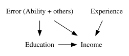
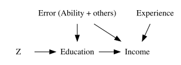

```{r}
#| label: additional-libraries
#| include: false
#| cache: false

#--- load packages ---#
library(broom)
library(fixest)
library(ggdag)
library(DiagrammeR)
library(dplyr)
library(data.table)
library(ggplot2)

source(here::here("lectures/_lecture-theme.R"))
```


# Instrumental Variable (IV) Approach

<html><div style='float:left'></div><hr color='#EB811B' size=1px width=1000px></html>

## Instrumental Variable (IV) Approach

::: {.panel-tabset}

### Review of Endogeneity

<details class="transcript">
<summary>Transcript</summary>

Instrumental variables address a setting where the explanatory variable of interest is correlated with the structural error. That correlation can come from omitted variables, selection, reverse causality, or measurement error. OLS then cannot separate the regressor's causal effect from unobserved determinants of the outcome. IV does not make the original regressor exogenous. It searches for a distinct source of variation in that regressor that is unrelated to the outcome error.

</details>


**Endogeneity**
  
$E[u\mid x_1,\dots,x_k]\ne0$

The zero-conditional-mean assumption fails: the error term is systematically related to at least one explanatory variable.

<br>

**Endogenous independent variable**

If an explanatory variable $x_k$ is correlated with the error term, we call $x_k$ an endogenous explanatory variable.

+ Omitted variable 
+ Selection 
+ Reverse causality 
+ Measurement error

### Causal Diagram

::: {.panel-tabset}

#### Causal diagram of the model

<details class="transcript inline">
<summary>Transcript</summary>

The diagram represents our education example. Education may affect income, which is the arrow we want to estimate. Ability and other omitted factors affect both education and income, creating a backdoor path from education to income. Experience is included as an observed control. Because the common cause in the error points into both education and income, a regression of income on education and experience generally mixes the causal education effect with confounding from ability.

</details>

You want to estimate the causal impact of education on income.

+ Variable of interest: Education
+ Dependent variable: Income

```{r}
#| label: causal-diagramme-endogeneity
#| eval: false
#| echo: false
library(DiagrammeRsvg)
library(magrittr)
library(rsvg)

DiagrammeR::grViz("
digraph {
  graph [ranksep = 0.2]
  node [shape = plaintext]
    A [label = 'Education']
    Y [label = 'Income']
    C [label = 'Error (Ability + others)']
    E [label = 'Experience']
  edge [minlen = 2]
    A->Y
    E->Y
    C->A
    C->Y
  { rank = same; A; Y }
}
") %>%
  export_svg() %>%
  charToRaw() %>%
  rsvg_svg("lectures/11-instrumental-variable/causal_graph.svg")
```

**Causal diagram**



```{r echo = FALSE, include = F}
tidy_ggdag <- dagify(
  Income ~ Ability + Education + Experience,
  Education ~ Ability,
  exposure = "Education",
  outcome = "Income"
) %>%
  tidy_dagitty()

ggdag(tidy_ggdag) +
  # theme_dag() is a complete theme and paints its own white background, so the
  # transparency has to be added back on top of it rather than via lecture_theme.
  theme_dag() +
  theme(
    plot.background = element_rect(fill = "transparent", colour = NA),
    panel.background = element_rect(fill = "transparent", colour = NA)
  )
```

#### Causal diagram with an instrument

<details class="transcript inline">
<summary>Transcript</summary>

An instrument Z supplies variation that reaches income through education. Three ideas must hold. Relevance requires an arrow from Z to education after controls. Exclusion rules out a direct Z-to-income arrow. Exogeneity rules out an unobserved common cause linking Z to income. Under those conditions, the education variation induced by Z avoids the ability backdoor path. The diagram clarifies why predicting education is necessary but insufficient: a strong predictor that also affects income directly is not a valid instrument.

</details>

We want to find a variable like $Z$ in the diagram below:

```{r}
#| eval: false
#| echo: false
DiagrammeR::grViz("
digraph {
  graph [ranksep = 0.2]
  node [shape = plaintext]
    Z [label = 'Z']
    A [label = 'Education']
    Y [label = 'Income']
    C [label = 'Error (Ability + others)']
    E [label = 'Experience']
  edge [minlen = 2]
    A->Y
    E->Y
    C->A
    C->Y
    Z->A
  { rank = same; Z; A; Y}
}
") %>%
  export_svg() %>%
  charToRaw() %>%
  rsvg_svg("lectures/11-instrumental-variable/causal_graph_z.svg")
```

<br>

::: {.columns}
::: {.column width="50%"}



:::
<!--end of the 1st column-->
::: {.column width="50%"}
+ **Relevance:** $Z$ predicts education after controlling for the other exogenous variables.
+ **Exclusion:** $Z$ affects income only through education; it has no direct effect on income.
+ **Exogeneity:** $Z$ is uncorrelated with unobserved determinants of income in the structural error, including ability.
:::
<!--end of the 2nd column-->
:::
<!--end of the columns-->
:::
<!--end of panel-->

### Rough idea

<details class="transcript">
<summary>Transcript</summary>

In the structural model, x one is endogenous and x two is an included exogenous control. We seek excluded instruments Z that predict x one but belong outside the outcome equation. The first stage isolates the component of x one explained by Z and the exogenous controls. The second stage uses that component to estimate beta one. The phrase instrument-induced variation is important: IV identifies the effect for changes in x one generated by the instrument, subject to the validity assumptions.

</details>

**The Model**

$y=\beta_0 + \beta_1 x_1 + \beta_2 x_2 + u$

+ $x_1$ is endogenous: $E[u\mid x_1,x_2]\ne0$ (and typically $\operatorname{Cov}(u,x_1)\ne0$)
+ $x_2$ is exogenous: $E[u\mid x_2]=0$ (and $\operatorname{Cov}(u,x_2)=0$)

<br>

**Idea (very loosely put)**

Find one or more <span style = "color: blue;">instrumental variables</span> that are excluded from the structural outcome equation but predict the endogenous variable.

+ Use the instruments $Z$ to isolate variation in $x_1$ that is unrelated to the structural error.

+ Use that instrument-induced variation to estimate the causal effect of $x_1$ on $y$.

### Estimation procedure

::: {.panel-tabset}

#### Step 1

<details class="transcript">
<summary>Transcript</summary>

The first stage regresses the endogenous variable on every excluded instrument and every exogenous variable included in the structural equation. Including x two in both stages is essential; leaving it out of the first stage generally changes the estimator and can invalidate the projection. The fitted x one is the portion predictable from this instrument set. Relevance means the excluded instruments contribute predictive power after x two is held fixed.

</details>

**Idea**  

Project the endogenous variable onto the instruments and all included exogenous variables.

<br>

**Step 1: mathematically**


+ Regress the endogenous variable $x_1$ on the excluded instruments $Z=\{z_1,z_2\}$ and every exogenous variable included in the outcome equation (here, $x_2$).

$x_1 = \alpha_0 + \sigma_2 x_2 + \alpha_1 z_1 +\alpha_2 z_2 + v$

+ Obtain the predicted value of $x_1$ from this first-stage regression.

$\widehat{x}_1 = \widehat{\alpha}_0 + \widehat{\sigma}_2 x_2 + \widehat{\alpha}_1 z_1 + \widehat{\alpha}_2 z_2$

#### Step 2

<details class="transcript">
<summary>Transcript</summary>

Conceptually, replace x one with its fitted value and regress y on that fitted component plus x two. This reproduces the 2SLS slope coefficient. However, ordinary OLS software in this manual second stage treats the fitted regressor as if it were observed data and reports the wrong uncertainty. A dedicated IV command accounts for how the fitted values were constructed and produces the correct 2SLS variance estimate. Use the two steps to understand the estimator, not as the recommended implementation.

</details>

**Idea**

Use the fitted component of $x_1$ to estimate the structural coefficient $\beta_1$.

<br>

**Step 2: Mathematically**

Conceptually, regress $y$ on $\widehat{x}_1$ and $x_2$:

$y= \beta_0 + \beta_1 \widehat{x}_1+ \beta_2 x_2 + \varepsilon$

This reproduces the 2SLS coefficient, but a manually run second-stage OLS regression does <span style = "color: red;">not</span> report the correct 2SLS standard errors. In practice, estimate both stages with an IV command.

:::
<!--end of panel-->


### Example 

::: {.panel-tabset}

#### Model of interest

<details class="transcript">
<summary>Transcript</summary>

Education is endogenous because unobserved ability affects wages and is related to schooling. Experience is assumed exogenous for this illustration. IQ and number of siblings are candidate instruments, not automatically valid ones. IQ is likely related to ability, which threatens exogeneity and exclusion. Siblings may predict schooling through family resources, but family size could also proxy for background that affects wages directly. The example first demonstrates computation; later slides evaluate whether such variables deserve to be instruments.

</details>

**Model**

$\log(wage)=\beta_0+\beta_1 educ+\beta_2 exper+v, \qquad v=\beta_3 ability+e$

+ Regress $\log(wage)$ on $educ$ and $exper$ ($ability$ is omitted because it is unobserved).
+ $v=\beta_3 ability+e$ is the structural error term.
+ $educ$ is considered endogenous (correlated with $ability$)
+ $exper$ is considered exogenous (not correlated with $ability$)

<br>

**Instruments (Z)**

Suppose you are considering the following candidate instruments for illustration:

+ IQ test score $(IQ)$
+ number of siblings $(sibs)$

#### Step 1

<details class="transcript inline">
<summary>Transcript</summary>

The first-stage equation predicts education using experience, IQ, and siblings. The code estimates that model and stores each person's fitted years of education. Inspecting `educ_hat` helps make the projection concrete: it is not a cleaned version of education for each individual, but a linear prediction from the instrument set. The excluded instruments need to explain enough residual variation in education after experience for the second stage to be informative.

</details>

Regress $educ$ on $exper$, $IQ$, and $sibs$:

```{=tex}
\begin{align*}
educ = \alpha_0 + \alpha_1 exper + \alpha_2 IQ + \alpha_3 sibs + r
\end{align*}
```

Use the coefficient estimates on $\alpha_0$, $\alpha_1$, $\alpha_2$, and $\alpha_3$ to predict $educ$ as a function of $exper$, $IQ$, and $sibs$.

```{=tex}
\begin{align*}
\widehat{educ} = \widehat{\alpha_0} + \widehat{\alpha_1} exper + \widehat{\alpha_2} IQ + \widehat{\alpha_3} sibs
\end{align*}
```

<br>

```{webr-r}
#| autorun: true
data("wage2", package = "wooldridge")

#* regress educ on exper, IQ, and sibs
first_reg <- fixest::feols(educ ~ exper + IQ + sibs, data = wage2)

#* predict educ as a function of exper, IQ, and sibs
wage2 <- dplyr::mutate(wage2, educ_hat = first_reg$fitted.values)

#* see the predicted values
wage2 %>%
  dplyr::relocate(educ_hat) %>%
  head()
```

#### Step 2

<details class="transcript">
<summary>Transcript</summary>

The manual second stage uses log wage—not wage—because that is the specified structural outcome. Its coefficient on predicted education equals the 2SLS coefficient when the stages are constructed correctly. The printed OLS standard error is not valid for IV inference. This distinction is easy to miss because the regression runs without warning. Later we use `feols` IV syntax, which estimates the same coefficient and computes an appropriate variance in a single call.

</details>

Use $\widehat{educ}$ in place of $educ$ to estimate the model of interest:

```{=tex}
\begin{align*}
\log(wage) = \beta_0 + \beta_1 \widehat{educ} + \beta_2 exper + \varepsilon
\end{align*}
```

<br>

```{webr-r}
#| autorun: true
 
#* coefficient demonstration only: these OLS standard errors are not valid for 2SLS
second_reg <- fixest::feols(log(wage) ~ educ_hat + exper, data = wage2)

#* see the results
second_reg
```

The coefficient on `educ_hat` illustrates the second-stage coefficient. Do not use the standard error from this manually fitted regression; the IV implementation below computes the correct 2SLS variance estimate.

:::
<!--end of panel-->

:::
<!--end of panel-->

## When does IV work? 

::: {.panel-tabset}

### Introduction

<details class="transcript">
<summary>Transcript</summary>

IV consistency rests on assumptions about the instruments, just as OLS consistency rests on assumptions about regressors and errors. The two broad requirements are relevance and validity. Relevance asks whether the excluded instruments move the endogenous variable after controls. Validity combines exclusion and exogeneity: the instruments must affect the outcome only through the endogenous regressor and must be unrelated to the structural error. A convincing IV study needs both statistical diagnostics and a substantive research-design argument.

</details>

Just as OLS requires assumptions for consistency, IV requires conditions on the proposed instruments.

<br>

**Estimation Procedure**

+ Step 1: $\widehat{x}_1 = \widehat{\alpha}_0 +\widehat{\sigma}_2 x_2 + \widehat{\alpha}_1 z_1 + \widehat{\alpha}_2 z_2$  

+ Step 2: $y = \beta_0 + \beta_1 \widehat{x}_1+ \beta_2 x_2 + \varepsilon$

<br>

**Important question**

What are the conditions under which IV estimation is consistent?

The instruments $Z$ must be relevant and valid, as discussed next.

### Condition 1

<details class="transcript">
<summary>Transcript</summary>

If the excluded instruments have zero first-stage coefficients, fitted x one contains nothing beyond the included exogenous controls. There is then no independent variation with which to identify beta one. Nonzero prediction is relevance, but useful IV also requires adequate strength. In finite samples, a weak first stage can make 2SLS unstable and conventional confidence intervals unreliable even if a significance test rejects exact zero. We will return to diagnostics near the end of the lecture.

</details>

**Estimation Procedure**

+ Step 1: $\widehat{x}_1 = \widehat{\alpha}_0 +\widehat{\sigma}_2 x_2 + \widehat{\alpha}_1 z_1 + \widehat{\alpha}_2 z_2$  

+ Step 2: $y = \beta_0 + \beta_1 \widehat{x}_1+ \beta_2 x_2 + \varepsilon$

<br>

**Question**

What happens if $Z$ has no power to explain $x_1$ ($\alpha_1=0$ and $\alpha_2=0$)?

<br>
<details>
  <summary>Answer</summary>
+ $\widehat{x}_1=\widehat{\alpha}_0+\widehat{\sigma}_2x_2$
+ There is no instrument-induced variation left to identify $\beta_1$.

That is, $\widehat{x}_1$ contains no information beyond what $x_2$ already provides.

**Relevance requires the excluded instruments to predict $x_1$ after controlling for the other exogenous variables.** Statistical significance is a useful diagnostic, but instruments must also be sufficiently strong for reliable conventional IV inference.
</details>

### Condition 2

::: {.columns}

::: {.column width="50%"}
**Model of interest**

$y = \beta_0 + \beta_1 x_1 + \beta_2 x_2 + u$ 
:::
<!--end of the 1st column-->
::: {.column width="50%"}
**Estimation Procedure**

+ Step 1: $\widehat{x}_1 = \widehat{\alpha}_0 +\widehat{\sigma}_2 x_2 + \widehat{\alpha}_1 z_1 + \widehat{\alpha}_2 z_2$  

+ Step 2: $y = \beta_0 + \beta_1 \widehat{x}_1+ \beta_2 x_2 + \varepsilon$
:::
<!--end of the 2nd column-->
:::
<!--end of the columns-->


::: {.panel-tabset}

#### Investigation of the model

<details class="transcript">
<summary>Transcript</summary>

The first-stage projection splits x one into a fitted component and a residual. Substitute that decomposition into the structural equation. The conceptual second-stage disturbance contains the original outcome error plus beta one times the first-stage residual. OLS on fitted x one requires that fitted component to be unrelated to this composite disturbance. Projection makes the fitted value orthogonal to the first-stage residual in sample, but we still need the instruments and included controls to be unrelated to the structural error u.

</details>

The first stage decomposes $x_1$ into its fitted component and residual:

```{=tex}
\begin{align*}
x_1 = \widehat{x}_1 + \widehat{\varepsilon}
\end{align*}
```

where $\widehat{\varepsilon}$ is the first-stage residual.

Substituting $x_1=\widehat{x}_1+\widehat{\varepsilon}$ into the model of interest gives

```{=tex}
\begin{align*}
y & =  \beta_0 + \beta_1 (\widehat{x}_1 + \widehat{\varepsilon}) + \beta_2 x_2+ u\\

 & = \beta_0 + \beta_1 \widehat{x}_1 + \beta_2 x_2+ (\beta_1\widehat{\varepsilon} + u)
\end{align*}
```

Thus, in the conceptual second-stage equation, the composite error is $\beta_1\widehat{\varepsilon}+u$.

<br>

**Question**

What condition is needed for the second-stage coefficient to be consistent?

<br>
<details>
  <summary>Answer</summary>
$\widehat{x}_1$ must be asymptotically uncorrelated with $\beta_1\widehat{\varepsilon}+u$.
</details>

#### When is it consistent?

<details class="transcript">
<summary>Transcript</summary>

The algebra isolates the remaining requirement. Because the fitted value is built from x two, z one, and z two, those variables must not carry information about u. Orthogonality to the first-stage residual follows mechanically from least squares; orthogonality to the structural error does not. It comes from the design. This is why an excellent predictor can still be a bad instrument: predictive power addresses the first stage, while correlation with u invalidates the second-stage comparison.

</details>

We confirmed that we need the following condition to be satisfied:

::: {.callout-note title="Condition"}
$\widehat{x}_1$ must be asymptotically uncorrelated with $\beta_1\widehat{\varepsilon}+u$.
:::


This requires the included exogenous variable $x_2$ and the excluded instruments $z_1,z_2$ to be uncorrelated with the structural error $u$.

By construction, $\widehat{x}_1$ is orthogonal in sample to the first-stage residual $\widehat{\varepsilon}$.

#### So,

<details class="transcript">
<summary>Transcript</summary>

Validity has two related pieces. Exclusion says an excluded instrument has no direct pathway to y once x one and the included controls are held fixed. Exogeneity says it is uncorrelated with unobserved determinants in u. Neither condition can be verified by a first-stage regression because u and the excluded counterfactual pathways are unobserved. Overidentification tests can sometimes reject the joint restrictions when there are extra instruments, but passing does not certify that every instrument is valid. The main evidence must be institutional and causal reasoning.

</details>

::: {.callout-important title="Condition 2: Instrument validity"}
+ **Exclusion:** $z_1$ and $z_2$ have no direct effect on $y$ after controlling for $x_1$ and $x_2$; they belong in the first stage but not the structural outcome equation.

+ **Exogeneity:** $z_1$ and $z_2$ are uncorrelated with the structural error $u$.
:::

<br>

**Question**

Do you think we can test condition 2?

<br>
<details>
  <summary>Answer</summary>
Not directly, because the structural error is unobserved. With more excluded instruments than endogenous variables, overidentification tests can sometimes detect a violation of the joint restrictions, but passing such a test does not prove that every instrument is valid.
</details>

<br>


::: {.callout-important}
+ The research design must provide a credible <span style = "color: red;">argument</span> for instrument exogeneity and exclusion.

+ Empirical IV studies should explain the causal mechanism, examine possible violations, and report relevant diagnostics.
:::

:::
<!--end of panel-->

### Review of the conditions

<details class="transcript">
<summary>Transcript</summary>

Keep the conditions separate. Relevance and strength concern the relationship between Z and x one conditional on included exogenous variables; they can be investigated empirically. Exclusion and exogeneity concern pathways from Z to y and relationships with u; they require a research-design argument. A large first-stage F statistic cannot rescue an invalid instrument, and a beautifully exogenous variable that does not move x one cannot identify the effect. Both halves are indispensable.

</details>

**Condition 1**

+ The excluded instruments $Z$ predict the endogenous variable $x_1$ <span style = "color: red;">after</span> controlling for all included exogenous variables, and the first stage is sufficiently strong.


<br>

**Condition 2**

+ **Exclusion:** $z_1$ and $z_2$ do not directly affect $y$ outside their effect through $x_1$.

+ **Exogeneity:** $z_1$ and $z_2$ are uncorrelated with the structural error.

<br>

::: {.callout-important}
+ First-stage relevance and strength can be assessed empirically, although no single diagnostic settles every weak-instrument problem.

+ Instrument validity cannot be established from the data alone. Overidentification tests are available in overidentified models, but they test joint restrictions and cannot certify validity.
:::


### 2SLS

<details class="transcript">
<summary>Transcript</summary>

Two-stage least squares is named for the projection logic we have traced, but estimation should be performed by an IV routine. With valid and sufficiently relevant instruments, 2SLS is consistent as the sample grows. It is not generally unbiased in a finite sample, and weak instruments can make its finite-sample behavior especially poor. Report the structural estimate together with first-stage information, appropriate standard errors, the instrument-validity argument, and sensitivity analyses.

</details>

The most common IV estimator is two-stage least squares (2SLS), named for its two conceptual projection stages.

+ Step 1: $\widehat{x}_1 = \widehat{\alpha}_0 +\widehat{\sigma}_2 x_2 + \widehat{\alpha}_1 z_1 + \widehat{\alpha}_2 z_2$  

+ Step 2: $y = \beta_0 + \beta_1 \widehat{x}_1+ \beta_2 x_2 + \varepsilon$     

The two stages explain how the coefficient is constructed. In practice, use a dedicated IV/2SLS command so that the coefficient and its standard error are computed correctly in one estimation call.

Even with valid instruments, 2SLS is generally not exactly unbiased in finite samples. Its central justification is consistency as the sample size grows.


:::
<!--end of panel-->

## Instrumental variable validity

::: {.panel-tabset}

### Setup

<details class="transcript">
<summary>Transcript</summary>

Apply the abstract conditions to the wage equation. A candidate z must predict education after experience is controlled for. It must also be excluded from the wage equation and unrelated to ability and every other unobserved wage determinant in v. The second requirement is deliberately demanding. For each candidate, tell a causal story about why z changes schooling and then actively search for every other route by which it could be associated with wages.

</details>

**The model**

$\log(wage)=\beta_0+\beta_1 educ+\beta_2 exper+v, \qquad v=\beta_3 ability+u$

`educ` is endogenous because of its correlation with `ability`.

<br>

**Question**

What conditions would a good instrument $(z)$ satisfy?

<br>

<br>
<details>
  <summary>Answer</summary>
+ **Relevance:** $z$ predicts $educ$ <span style = "color: blue;">after</span> controlling for $exper$.

+ **Validity:** $z$ has no direct effect on wages and is uncorrelated with $v$ (ability and all other unobserved wage determinants).
</details>

### Instrument example 1

<details class="transcript">
<summary>Transcript</summary>

The last digit of a Social Security number might appear plausibly random and therefore exogenous. But it almost certainly has no systematic relationship with education after experience, so it fails relevance. Random noise is not an instrument merely because it is unrelated to the outcome error. We need a variable that is both plausibly as-good-as-random with respect to u and capable of shifting the endogenous regressor.

</details>

**The model**

$\log(wage)=\beta_0+\beta_1 educ+\beta_2 exper+v, \qquad v=\beta_3 ability+u$

<br>

**Instrument**

The last digit of an individual's Social Security number?

<br>

**Question**

+ Is it uncorrelated with $v$ ($ability$ and all the other important unobservables)?

+ Does it predict $educ$ after controlling for $exper$?

### Instrument example 2

<details class="transcript">
<summary>Transcript</summary>

IQ probably predicts education, so relevance may be strong. Its validity is much less plausible because IQ can proxy for ability, which sits directly in the wage error, and it may affect productivity and wages outside its effect through schooling. This is a useful example of a strong predictor that is not automatically a valid excluded instrument. Controlling imperfectly for ability does not make the exclusion concern disappear.

</details>

**The model**

$\log(wage)=\beta_0+\beta_1 educ+\beta_2 exper+v, \qquad v=\beta_3 ability+u$

<br>

**Instrument**

IQ test score

<br>

**Question**

+ Is it uncorrelated with $v$ ($ability$ and all the other important unobservables)?

+ Does it predict $educ$ after controlling for $exper$?

### Instrument example 3

<details class="transcript">
<summary>Transcript</summary>

Mother's education likely predicts a child's education through expectations, resources, and access, satisfying relevance. Those same family-background channels can affect wages through networks, wealth, neighborhood, health, or inherited skills even holding the child's schooling fixed. They can also be correlated with unobserved ability. The candidate therefore faces serious exclusion and exogeneity concerns. The point is to interrogate the full causal pathway, not simply to observe a first-stage relationship.

</details>

**The model**

$\log(wage)=\beta_0+\beta_1 educ+\beta_2 exper+v, \qquad v=\beta_3 ability+u$

<br>

**Instrument**

Mother's education

<br>

**Question**

+ Is it uncorrelated with $v$ ($ability$ and all the other important unobservables)?

+ Does it predict $educ$ after controlling for $exper$?

### Instrument example 4

<details class="transcript">
<summary>Transcript</summary>

Number of siblings may reduce educational resources per child and thus predict schooling. But family size can be associated with parental preferences, income, birth order, neighborhood, and other background factors that influence wages directly. It may be relevant while still invalid. Whether it can serve as an instrument depends on a defensible institutional argument and controls; the variable's presence in a textbook dataset is not evidence of validity.

</details>

**The model**

$\log(wage)=\beta_0+\beta_1 educ+\beta_2 exper+v, \qquad v=\beta_3 ability+u$

<br>
**Instrument**

Number of siblings

<br>

**Question**

+ Is it uncorrelated with $v$ ($ability$ and all the other important unobservables)?

+ Does it predict $educ$ after controlling for $exper$?

:::
<!--end of panel-->

## Implementation of Instrumental Variable (IV) Estimation in R

::: {.panel-tabset}
### Introduction

<details class="transcript">
<summary>Transcript</summary>

For the implementation example, education is the endogenous regressor, experience is included as exogenous, and siblings plus father's education are candidate excluded instruments. Calling them instruments describes their role in the formula, not proof that they are valid. Experience also belongs to the instrument set because every included exogenous variable instruments for itself. A complete analysis would defend the family-background exclusions before interpreting the resulting education coefficient causally.

</details>

**Model**

$\log(wage)=\beta_0+\beta_1 educ+\beta_2 exper+v, \qquad v=\beta_3 ability+u$

We believe

+ $educ$ is endogenous $(x_1)$

+ $exper$ is exogenous $(x_2)$

+ We use the number of siblings (`sibs`) and father's education (`feduc`) as candidate excluded instruments $Z$ for this illustration. Their validity must be defended rather than assumed.

<br>

**Terminology**

+ An exogenous variable included in the outcome equation (here, $exper$) also serves as an <span style = "color: blue;">included instrument</span>.

+ Instruments excluded from the outcome equation (here, $sibs$ and $feduc$) are called <span style = "color: blue;">excluded instruments</span>.

+ we refer to the collection of included and excluded instruments as <span style = "color: blue;">instruments</span>

### Dataset

<details class="transcript inline">
<summary>Transcript</summary>

Inspect the variables before estimating. Wage is observed in levels but the structural model uses its logarithm. Education is measured in years, while siblings and father's education supply the proposed excluded variation. Also examine missingness and sample size because IV uses observations complete on the outcome, endogenous regressor, controls, and instruments. A first-stage relationship in this sample is only one part of the design.

</details>

```{webr-r}
#| autorun: true
#--- take a look at the data ---#
wage2 %>%
  select(wage, educ, sibs, feduc) %>%
  head()
```

### How

<details class="transcript">
<summary>Transcript</summary>

Read the `fixest` IV formula in three pieces. Before the first vertical bar is the structural outcome equation and its included exogenous controls. After the bar is the endogenous variable followed by a tilde and the excluded instruments. Here the command estimates log wage on experience, instruments education with siblings and father's education, and automatically includes experience in the first-stage instrument set. This single call supplies correct 2SLS coefficients and variance calculations.

</details>

We can use the `fixest` package to estimate the IV model.

**Syntax**

```{r eval = F}
fixest::feols(dep_var ~ included_exogenous | endogenous ~ excluded_instruments, data = dataset)
```

+ `included_exogenous`: exogenous variables included in the structural outcome equation

<br>

**First-stage formula**

```{r eval = F}
(endogenous_vars ~ excluded_instruments)
```

<br>

**Example**

```{webr-r}
#| autorun: true
iv_res <- fixest::feols(log(wage) ~ exper | educ ~ sibs + feduc, data = wage2)
```

+ `included variables`:
  * exogenous included variables: `exper`
  * endogenous included variables: `educ` 
+ `instruments`: 
  * included instruments: `exper` 
  * excluded instruments: `sibs` and `feduc`

### Results

<details class="transcript inline">
<summary>Transcript</summary>

In the output, `educ(fit)` denotes the instrumented education regressor; it is the coefficient on education in the structural equation, not a coefficient from the first stage. Interpret it as a causal return to an additional year of schooling only if the instruments are relevant, sufficiently strong, excluded, and exogenous. The reported estimate alone cannot establish those conditions. We should inspect first-stage diagnostics and defend what siblings and father's education can affect.

</details>

**IV regression results**

```{webr-r}
#| autorun: true
iv_res
```

<br>

**Note**

+ When variable `x` is the endogenous variable, `fixest` changes the name of `x` to `x(fit)`.

+ Here, `educ` has become `educ(fit)`.

### Comparison

<details class="transcript inline">
<summary>Transcript</summary>

The OLS and IV estimates need not match because they use different variation. OLS uses all residual education variation and is vulnerable to ability confounding. IV uses only the component associated with the proposed instruments and can be less precise. A difference between estimates does not prove OLS is biased or IV is correct. Ask whether family background strongly predicts schooling and whether it can influence wages through channels other than schooling. Those validity questions dominate a mechanical comparison of coefficient sizes.

</details>

::: {.columns}

::: {.column width="60%"}
**Comparison of OLS and IV Estimation Results**

```{r echo = F}
data(wage2, package = "wooldridge")

#--- IV drops observations with missing feduc, so restrict OLS to the same sample ---#
wage2_iv <- dplyr::filter(wage2, !is.na(feduc))

#--- OLS ---#
reg_ols <- fixest::feols(log(wage) ~ educ + exper, data = wage2_iv)

#--- iv ---#
iv_res <- fixest::feols(log(wage) ~ exper | educ ~ sibs + feduc, data = wage2_iv)

#--- Stargaze ---#
modelsummary::msummary(
  list(OLS = reg_ols, IV = iv_res),
  # keep these options as they are
  stars = TRUE,
  gof_omit = "IC|Log|Adj|F|Pseudo|Within"
)
```

:::{.callout-important title="Compare like with like"}
`feduc` is missing for 194 of the 935 observations in `wage2`, and IV silently drops them. If you run OLS on the full sample and IV on the reduced one, part of the difference between the two columns is just a <span style = "color: red;">change of sample</span>, not endogeneity. Both columns above use the same 741 observations.
:::
:::
<!--end of the 1st column-->
::: {.column width="40%"}
**Question**

Do you think `sibs` and `feduc` are valid and sufficiently strong instruments?

+ Relevance and strength: do they strongly predict education conditional on experience?
+ Exclusion and exogeneity: could family background affect wages through channels other than education?

:::
<!--end of the 2nd column-->
:::
<!--end of the columns-->

### Fixed effects

<details class="transcript">
<summary>Transcript</summary>

IV and fixed effects can be combined. The second formula section absorbs the listed fixed effects, while the final section defines the endogenous variable and excluded instruments. The instrument must retain relevant variation after those fixed effects and controls are removed, and validity must hold for that within-group variation. In this toy syntax example, treating binary marital status and region as fixed-effect groups is computationally possible, but an applied specification should be motivated by the actual panel or grouping structure.

</details>

You can include fixed effects in your IV estimation.

**Syntax**
```{r eval = F}
fixest::feols(dep_var ~ included_exogenous | fixed_effects | endogenous ~ excluded_instruments, data = dataset)
```

<br>

**Example**

Include `married` and `south` as fixed effects.
```{r }
fixest::feols(log(wage) ~ exper | married + south | educ ~ feduc + sibs, data = wage2)
```

### Clustered SE

<details class="transcript">
<summary>Transcript</summary>

IV does not eliminate dependence in regression errors. If observations share shocks within states, schools, firms, or people over time, cluster at the level justified by the design. The placeholder `cluster_id` emphasizes that the clustering variable is not chosen for convenience or because it is binary; it represents groups within which errors may be correlated. As with OLS, few clusters or dependence across clusters may require methods beyond conventional clustered standard errors.

</details>

Add the `cluster` argument when the research design calls for clustered inference. The clustering variable must represent the groups within which errors may be dependent; it should not be chosen merely because it is available.

```{r eval = F}
fixest::feols(
  outcome ~ controls | fixed_effects | endogenous ~ excluded_instruments,
  cluster = ~cluster_id,
  data = dataset
)
```


:::
<!--end of panel-->

## Weak instruments

::: {.panel-tabset}

### What is it?

<details class="transcript">
<summary>Transcript</summary>

A weak instrument is related to the endogenous regressor, but only slightly after included controls are removed. Weakness is about the amount of identifying information, not merely whether a first-stage coefficient is exactly zero. When the first stage is weak, the instrument-induced variation is easily overwhelmed by sampling noise. Point estimates can become unstable, finite-sample bias can be substantial, and standard Wald tests and confidence intervals can have poor coverage.

</details>

::: {.callout-note title="Definition: weak instrument"}
Excluded instruments are weak when they provide too little variation in the endogenous regressor after conditioning on the included exogenous variables.
:::

<br>

::: {.callout-important}
First-stage diagnostics can reveal weak identification concerns, but no single cutoff or test resolves every weak-instrument problem.
:::

<br>

### How?

::: {.panel-tabset}

#### Steps

<details class="transcript">
<summary>Transcript</summary>

Estimate the first stage and jointly test whether the coefficients on all excluded instruments are zero. The joint test asks whether they add predictive content beyond experience. Rejecting exact zero is necessary evidence of relevance, but not a guarantee of adequate strength. The familiar F-greater-than-ten rule is a rough heuristic for simple homoskedastic settings, not a universal pass-fail standard. The appropriate weak-identification diagnostic depends on the number of instruments, endogenous variables, and variance estimator.

</details>

Run the first-stage regression:

```{=tex}
\begin{align*}
educ = \alpha_0 + \alpha_1 exper + \alpha_2 sibs + \alpha_3 feduc + v
\end{align*}
```

<br>

Then test $H_0:\alpha_2=\alpha_3=0$ with a first-stage F test.

Rejecting this null establishes that the instruments add some predictive power, but statistical significance alone does not guarantee that the first stage is strong enough for conventional IV inference.

#### R implementation

<details class="transcript inline">
<summary>Transcript</summary>

`fixest` reports the first-stage information with the IV result, and the first-stage model can also be inspected directly. Here the null of no excluded-instrument explanatory power is rejected. That tells us siblings and father's education are not jointly irrelevant in this sample. It does not establish that they are strong enough for every conventional approximation, and it says nothing about exclusion or exogeneity. Report the statistic in context rather than reducing the design to one cutoff.

</details>

::: {.columns}

::: {.column width="60%"}
When we estimated the IV model with `fixest::feols()`, the output included a first-stage F statistic for the excluded instruments.

```{webr-r}
#| autorun: true
iv_res
```

<br>

Here, the F test rejects the null that `sibs` and `feduc` have no first-stage explanatory power for `educ` after controlling for `exper`.

<br>
<details>
  <summary>Alternatively</summary>
You can access the `iv_first_stage` component of the 
regression results.

```{webr-r}
#| autorun: true
iv_res$iv_first_stage
```
</details>
:::
<!--end of the 1st column-->
::: {.column width="40%"}
::: {.callout-note}
+ The familiar first-stage $F>10$ rule is only a rough diagnostic for relatively simple homoskedastic models; appropriate weak-identification diagnostics depend on the design and variance estimator.

+ A statistically significant but small first-stage F statistic can still indicate weak identification.

+ First-stage diagnostics provide no evidence about exclusion or exogeneity.

+ Failure to reject the zero-first-stage null is strong evidence that the proposed instruments are not useful for conventional IV estimation.

+ Always report appropriate first-stage and weak-identification diagnostics.
:::

:::
<!--end of the 2nd column-->
:::
<!--end of the columns-->


:::
<!--end of panel-->


### Consequences of weak instruments 

::: {.panel-tabset}

#### Data generating process

<details class="transcript inline">
<summary>Transcript</summary>

The simulation creates an endogenous x because `u_common` enters both x and the outcome error. Both proposed instruments are built from `z_common`, which is independent of the outcome error, so they are valid by construction. The strong instrument contains a substantial share of `z_common`; the weak instrument contains only one percent and is dominated by unrelated noise. The true structural coefficient on x is one. This lets us isolate strength while holding validity fixed.

</details>

**Data generation**

```{webr-r}
set.seed(73289)
N <- 500 # number of observations

u_common <- runif(N) # the term shared by the endogenous variable and the error term
z_common <- runif(N) # the term shared by the endogenous variable and instruments
x_end <- u_common + z_common + runif(N) # the endogenous variable
z_strong <- z_common + runif(N) # strong instrument
z_weak <- 0.01 * z_common + 0.99995 * runif(N) # weak instrument
u <- u_common + runif(N) # error term
y <- x_end + u # dependent variable

data <- data.frame(y, x_end, z_strong, z_weak)
```

<br>

**Correlation**

```{webr-r}
cor(data)
```

#### Estimation

<details class="transcript inline">
<summary>Transcript</summary>

Estimate the same structural model twice, changing only the instrument. With the strong instrument, the estimate should usually sit reasonably near the true value of one. With the weak instrument, a single sample can produce a very large or erratic estimate and a misleading conventional standard error. Do not generalize from one random draw; the next Monte Carlo experiment repeats the design to reveal the sampling distributions.

</details>

**Estimation with the strong instrumental variable**

```{webr-r}
#--- IV estimation (strong) ---#
iv_strong <- fixest::feols(y ~ 1 | x_end ~ z_strong, data = data)

#--- coefs (strong) ---#
tidy(iv_strong)
```

<br>

**Estimation with the weak instrumental variable**

```{webr-r}
#--- IV estimation (weak) ---#
iv_weak <- fixest::feols(y ~ 1 | x_end ~ z_weak, data = data)

#--- coefs (weak) ---#
tidy(iv_weak)
```

<br>

**Question**

Any notable differences?

<br>
<details>
  <summary>Answer</summary>
In this draw, the coefficient estimate on `x_end` is far from the true value in the weak-instrument case. Weak instruments generally produce unstable estimates and unreliable conventional inference.
</details>

#### Comparison of the weak instrument tests

<details class="transcript inline">
<summary>Transcript</summary>

The first-stage outputs should mirror the construction. The strong instrument explains a meaningful portion of x, while the weak instrument contributes almost none and may fail to reject the zero-first-stage null. These diagnostics concern relevance and strength only. Both instruments are exogenous in the simulation because we generated them independently of the outcome error, a fact we know only because we control the data-generating process.

</details>

::: {.columns}

::: {.column width="50%"}

**diagnostics (strong instrument)**

```{webr-r}
iv_strong$iv_first_stage
```

:::
<!--end of the 1st column-->
::: {.column width="50%"}

**diagnostics (weak instrument)**

```{webr-r}
iv_weak$iv_first_stage
```

:::
<!--end of the 2nd column-->
:::
<!--end of the columns-->
<br>

::: {.callout-note}
In the weak-instrument design, the first-stage diagnostic fails to reject the null that the excluded instrument has zero first-stage explanatory power.
:::


#### MC simulation

::: {.panel-tabset}

##### Run 

<details class="transcript">
<summary>Transcript</summary>

Now repeat the experiment one thousand times. Each iteration regenerates the shared components, estimates IV with the strong instrument and then with the weak instrument, and stores both coefficient estimates. The structural coefficient remains one in every replication. Comparing the stored distributions shows how much sampling variability comes from the instrument's first-stage strength rather than from a change in the target parameter or validity.

</details>

```{r}
set.seed(238354)
B <- 1000 # the number of experiments
N <- 500 # number of observations
beta_hat_store <- matrix(0, B, 2) # storage of beta hat

for (i in 1:B) {

  #--- data generation ---#
  u_common <- runif(N)
  z_common <- runif(N)
  x_end <- u_common + z_common + runif(N)
  z_strong <- z_common + runif(N)
  z_weak <- 0.01 * z_common + 0.99995 * runif(N)
  u <- u_common + runif(N)
  y <- x_end + u
  data <- data.table(y, x_end, z_strong, z_weak)

  #--- IV estimation with a strong instrument ---#
  iv_strong <- fixest::feols(y ~ 1 | x_end ~ z_strong, data = data)
  beta_hat_store[i, 1] <- iv_strong$coefficients[2]

  #--- IV estimation with a weak instrument ---#
  iv_weak <- fixest::feols(y ~ 1 | x_end ~ z_weak, data = data)
  beta_hat_store[i, 2] <- iv_weak$coefficients[2]
}
```

##### Visualization of the results

<details class="transcript inline">
<summary>Transcript</summary>

The strong-instrument estimates concentrate around the red line at the true value. The weak-instrument distribution is far more dispersed and irregular. For readability, the graph omits estimates whose absolute value exceeds five; those omitted extremes are evidence of the instability, not harmless outliers to be ignored. The exercise explains why conventional IV inference can fail even when an instrument is technically relevant and valid but predicts too little of the endogenous variable.

</details>

```{r}
#| code-fold: true

melted <- melt(data.table(beta_hat_store))
melted[variable == "V1", variable := "Strong"]
melted[variable == "V2", variable := "Weak"]

ggplot(data = melted[abs(value) < 5, ]) +
  geom_density(aes(x = value, fill = variable), alpha = 0.3) +
  geom_vline(xintercept = 1, color = "red") +
  scale_fill_discrete(name = "") +
  theme_lecture +
  theme(
    legend.position = "bottom"
  )
```

The plot omits estimates with absolute value greater than 5 so that the central portions of the distributions remain visible; extreme estimates are themselves a symptom of weak identification.

:::
<!--end of panel-->

:::
<!--end of panel-->
:::
<!--end of panel-->


## Flow of IV Estimation in Practice

<details class="transcript">
<summary>Transcript</summary>

Use this sequence as a checklist. Begin with the structural equation and explain why each endogenous variable is endogenous. Propose excluded instruments and defend exclusion and exogeneity using the institutional setting. Then establish that they predict the endogenous variables after all controls and fixed effects, using appropriate weak-identification diagnostics. Finally, estimate with standard errors that match the sampling design and report assumptions, first stages, diagnostics, and sensitivity checks. IV credibility comes from the entire chain, not from the final coefficient alone.

</details>

::: {.callout-note title="Flow"}
1. Identify the endogenous variables and the exogenous controls included in the structural equation.

2. Identify candidate excluded instruments.

3. <span style = "color: blue;">Argue</span> why the excluded instruments satisfy exclusion and exogeneity (**validity**).

4. Assess first-stage relevance and <span style = "color: red;">weak-identification diagnostics</span> (**strength**).

5. Estimate the IV model with appropriate standard errors and report the first stage, diagnostics, identifying assumptions, and sensitivity checks.


:::
