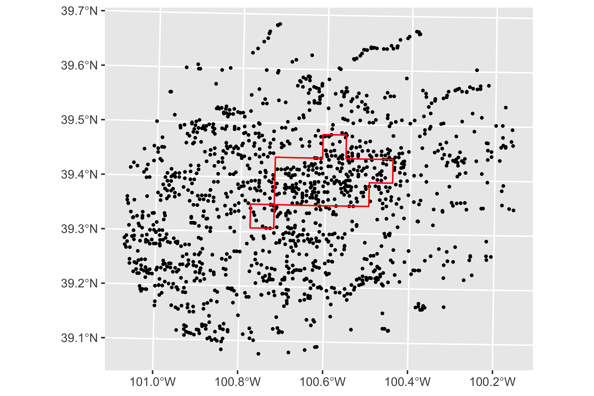

```{r}
#| label: additional-libraries
#| include: false
#--- load packages ---#
library(knitr)
library(fixest)
library(ggplot2)
library(data.table)
library(flextable)
library(dplyr)
library(modelsummary)

source(here::here("lectures/_lecture-theme.R"))

#--- load the kielmc data ---#
data(kielmc, package = "wooldridge")

#--- change the scale of a variable ---#
data <- dplyr::mutate(kielmc, rprice = rprice / 1000)
```

# Impact (Program) Evaluation

<html><div style='float:left'></div><hr color='#EB811B' size=1px width=1000px></html>

## Impact Evaluation

::: {.panel-tabset}

### What is it?

<details class="transcript">
<summary>Transcript</summary>

Impact evaluation asks what a program or event caused, not merely what happened after it. The causal challenge is the missing counterfactual: for a treated unit, we do not observe what its outcome would have been at the same time without treatment. Most real programs are not randomly assigned, so participants can differ systematically from nonparticipants. Difference-in-differences is one design for constructing a credible comparison when treatment begins for one group but not another.

</details>

**Definition**

Impact (program) evaluation is a field of econometrics that focuses on estimating the impact of a program or event.

<br>

**Examples**

+ Groundwater use limit in Nebraska $\Rightarrow$ water use 
+ Technology adoption (soil moisture sensor) $\Rightarrow$ water use 
+ Crop insurance $\Rightarrow$ input use 
+ Job training program $\Rightarrow$ productivity
+ Food assistance program $\Rightarrow$ health, education, etc.

::: {.callout-note title="Key challenge"}
Most of the programs you are interested in evaluating are not randomized.

$\;\;\;\;\;\;\;\;\;\downarrow$

Endogeneity problem arising from self-selection into the program.
:::


### Gold standard 

<details class="transcript">
<summary>Transcript</summary>

Random assignment is the benchmark because it makes treatment independent of potential outcomes in expectation. Treated and control groups can still differ by chance in a particular sample, but assignment does not systematically favor one type. In the simple equation, this supports the zero-conditional-mean condition and lets the treatment indicator identify an average causal effect. Many policies cannot be randomized, so observational designs try to find variation that mimics the relevant part of an experiment.

</details>

**Gold Standard**

+ When feasible, a randomized experiment addresses selection bias by randomly assigning units to treatment and control groups.

+ Random assignment makes treatment status independent of potential outcomes in expectation.

<br>

**Example**

$y\;(\text{income})=\beta_0+\beta_1 program\;(\text{financial aid})+u$

where $E[u\mid program]=0$. In this simple setting, OLS consistently estimates the average treatment effect.

<br>

::: {.callout-note title="Problem"}
Many programs cannot be randomized for practical, financial, or ethical reasons.

$\downarrow$

We need to use data from an event that happened outside our control.
:::


### Natural (Quasi) Experiment

<details class="transcript">
<summary>Transcript</summary>

A natural experiment is not automatically random. It is an external event or institutional rule that changes treatment exposure, and the researcher must explain why the resulting variation is plausibly unrelated to untreated potential outcomes. The assignment mechanism, timing, affected population, and possible spillovers all matter. DID often studies policy changes of this kind by comparing an exposed group with an unexposed group before and after the event.

</details>

**Definition**

An event or policy change outside investigators' control that changes the environment in which individuals, families, firms, cities, or other units operate.

<br>

**Challenges**

Treatment is not assigned by the researcher, so its source of variation must be studied carefully. A credible natural experiment provides variation plausibly unrelated to untreated potential outcomes after conditioning on the design.

<br>

:::
<!--end of panel-->

## Assessment of various approaches

::: {.panel-tabset}

### Lecture objectives

<details class="transcript">
<summary>Transcript</summary>

We will compare three estimators of the same incinerator effect. The exercise is deliberately structured so each approach removes a different source of confounding. A post-treatment cross-section leaves baseline group differences and differential trends. A before-after comparison leaves common time changes. DID subtracts both, but it still depends on the treated and control groups having parallel untreated changes. The algebra will make each identifying assumption visible.

</details>

+ Discuss different ways of estimating the impact of a program including the difference in differences (DID) method.

+ Understand the strengths and weaknesses of these methods.

### Example program

<details class="transcript">
<summary>Transcript</summary>

The proposed incinerator creates a location-based treatment. Houses near the site are exposed; houses farther away form a potential control group. We observe prices in 1978, when rumors existed but construction had not begun, and in 1981, when construction began. That timing raises questions about anticipation: if rumors already affected prices in 1978, calling it an untreated baseline is imperfect. For the classroom design, we use these years to compare the three estimators.

</details>

**Incinerator Construction**

+ Rumors about an incinerator in North Andover, Massachusetts, began in 1978.

+ Construction began in 1981.

<br>

**Data collected**

Housing prices and other characteristics in 1978 and 1981 provide observations before and after construction began.

### Data

<details class="transcript inline">
<summary>Transcript</summary>

The `kielmc` data contain house prices, location relative to the incinerator, year indicators, and housing characteristics. Real price is rescaled into thousands of dollars so coefficients are easier to read. Check how `nearinc` and `y81` are coded: their interaction will identify the DID estimate. This is a repeated-cross-section application—houses observed in 1978 need not be the identical houses observed in 1981.

</details>

```{webr-r}
#| autorun: true
#--- load the kielmc data ---#
data(kielmc, package = "wooldridge")

#--- change the scale of a variable ---#
(
data <- 
  kielmc %>%
  as_tibble() %>%
  dplyr::mutate(rprice = rprice / 1000)
)
```

### Various approaches to evaluate

<details class="transcript">
<summary>Transcript</summary>

Approach one compares treated and control houses only after construction began. Approach two compares the treated area before and after. Approach three combines both comparisons. Each sounds reasonable in words, but each uses a different counterfactual. As we proceed, identify what would have happened to nearby-house prices without the incinerator and which observed quantity each approach uses as a substitute for that missing outcome.

</details>

::: {.callout-note title="Approach 1"}
Compare houses close to the incinerator site (treated) with houses farther away (control) <span style = "color: red;">after</span> construction began (1981 data).
:::

::: {.callout-note title="Approach 2"}
Compare nearby houses before and after construction began (1978 and 1981 data).
:::

::: {.callout-note title="Approach 3"}
Compare the before–after change for nearby houses with the before–after change for houses farther away: difference-in-differences.
:::


:::
<!--end of panel-->

## Approach 1

::: {.panel-tabset}

### Estimation strategy

<details class="transcript">
<summary>Transcript</summary>

The first strategy uses only the 1981 cross-section and compares houses near the site with those farther away. Delta one is a mean difference after construction began. For it to be causal, `nearinc` must be unrelated to every other determinant of price in 1981. That is demanding because neighborhoods differ in amenities, housing stock, access, and pre-existing desirability. Location is not randomly assigned, so we should expect `nearinc` to be endogenous without strong controls or design evidence.

</details>

Run regression on the following model using the 1981 data (cross-sectional data)

$rprice = \delta_0 + \delta_1 nearinc + u$

+ $rprice$: house price in real terms (inflation-corrected)

+ $nearinc$: 1 if the house is near the incinerator, and 0 otherwise


<br>

**Question**

Is `nearinc` endogenous?

### Interpretation

<details class="transcript">
<summary>Transcript</summary>

With a binary regressor and an intercept, delta zero is the mean for the far group and delta zero plus delta one is the mean for the near group. Subtracting gives delta one. This is a descriptive identity; it does not attach a causal label to the difference. The estimate includes any pre-existing price gap, any difference in price changes between locations, and the incinerator effect. Interpretation of the regression coefficient and identification of a causal effect are separate steps.

</details>

**Model**

$rprice = \delta_0 + \delta_1 nearinc + u$

<br>

**Question**

What does $\delta_1$ measure?


<br>
<details>
  <summary>Answer</summary>
<span style = "color: blue;">$\delta_1$</span>: the difference between the mean price of houses near the incinerator site and the mean price of houses farther away in 1981.

```{=tex}
\begin{align*}
& E[rprice | nearinc = 1, year = 1981] = \delta_0 + \delta_1 \\
& E[rprice | nearinc = 0, year = 1981] = \delta_0
\end{align*}
```

This means:

```{=tex}
\begin{align*}
\delta_1 = E[rprice | nearinc = 1, year = 1981] - E[rprice | nearinc = 0, year = 1981]
\end{align*}
```


</details>

### Estimate

<details class="transcript inline">
<summary>Transcript</summary>

The 1981 regression estimates the post-period gap directly. The coefficient on `nearinc` is the average real-price difference in thousands of dollars. Before deciding whether it represents harm from the incinerator, look at the pre-period. If nearby houses were already cheaper in 1978, the post-period gap cannot be attributed entirely to construction. Statistical significance does not repair that comparison problem.

</details>

```{webr-r}
#| autorun: true
(
reg_81 <-
  feols(
    rprice ~ nearinc,
    data = filter(data, year == 1981)
  )
)
```

<br>

**Question**
Is this reliable? 

### Take a look at 1978 

<details class="transcript inline">
<summary>Transcript</summary>

The 1978 regression reveals a substantial near-far price difference before construction began. That baseline gap could reflect neighborhood characteristics or anticipation caused by the earlier rumors. Either way, it shows why the 1981 cross-section is not a clean counterfactual comparison. A valid post-only design would require treated and control locations to have been comparable in untreated levels and changes, conditions the data already make doubtful.

</details>

::: {.columns}

::: {.column width="40%"}
Run regression on the following model using the <span style = "color: red;"> 1978 </span> data (cross-sectional data).

```{=tex}
\begin{align*}
rprice = \theta_0 + \theta_1 nearinc + u
\end{align*}
```

$\theta_1$ represents the difference between the mean house price of houses nearby the incinerator and the rest (not nearby) <span style = "color: red;"> before </span> the incinerator was built.
:::
<!--end of the 1st column-->
::: {.column width="60%"}
```{webr-r}
#| autorun: true
(
reg_78 <-
  feols(
    rprice ~ nearinc,
    data = filter(data, year == 1978)
  )
)
```
:::
<!--end of the 2nd column-->
:::
<!--end of the columns-->


<br>

::: {.callout-note title="Critical"}
Prices of houses near the incinerator site were already lower than prices of houses farther away <span style = "color: blue;">before</span> construction began.
:::


### Visualization

<details class="transcript inline">
<summary>Transcript</summary>

The bars display the four group-time means that underlie every estimator in this section. First compare near with far within 1981: that is Approach one. Then compare the same groups in 1978 and note the pre-existing level gap. Finally compare how each group's bar changes across years; DID will subtract those changes. Reading the four means visually is often the fastest way to detect what a two-by-two regression is doing.

</details>

```{r echo = F}
data_mean <- 
  data %>%
  group_by(year, nearinc) %>%
  dplyr::summarize(m_rprice = mean(rprice))

ggplot() +
  geom_bar(
    data = data_mean,
    aes(
      y = m_rprice,
      x = factor(year),
      fill = factor(nearinc)
    ),
    stat = "identity",
    position = "dodge"
  ) +
  ylab("Mean House Price ($1000$)") +
  xlab("Year") +
  scale_fill_discrete(name = "") +
  theme_lecture +
  theme(legend.position = "bottom")
```

### Understanding the approach

<details class="transcript">
<summary>Transcript</summary>

The notation decomposes each observed mean. Gamma zero and gamma one are baseline means for far and near houses. Alpha zero and alpha one are the changes each group would experience from all causes other than treatment. Beta is the causal incinerator effect on the treated group. Approach one subtracts the two post-period means, leaving the baseline gap, the difference in untreated changes, and beta. It identifies beta only if both nuisance differences are zero—far stronger than merely having an untreated comparison group.

</details>

::: {.columns}

::: {.column width="50%"}

<br>

```{r echo = F}
ex_results_tab <- data.frame(
  `treated` = c("nearinc = 0", "nearinc = 1"),
  `before` = c("\\(\\gamma_0\\)", "\\(\\gamma_1\\)"),
  after = c("\\(\\gamma_0 + \\alpha_0 + 0\\)", "\\(\\gamma_1 + \\alpha_1 + \\beta \\)")
) %>%
  knitr::kable(
    format = "html",
    escape = FALSE
  )

ex_results_tab
```
:::
<!--end of the 1st column-->
::: {.column width="50%"}
::: {.callout-note title="New notation"}
From here on, $\gamma$, $\alpha$, and $\beta$ describe the four underlying group-time <span style = "color: blue;">means</span>. They are not the $\delta$'s and $\theta$'s from the two cross-sectional regressions above.
:::

+ $\gamma_j$ is the average house price of those that are $nearinc=j$ in 1978 (before)

+ $\alpha_j$ is the change caused by <span style = "color: blue;">all factors other than the incinerator</span> between the before and after periods for houses with $nearinc=j$.

+ $\beta$ is the true causal impact of the incinerator placement
:::
<!--end of the 2nd column-->
:::
<!--end of the columns-->


**What did we estimate with Approach 1?**

::: {.columns}

::: {.column width="50%"}
```{=tex}
\begin{align*}
& E[rprice|nearinc = 1, year = 1981] \\
  & \;\; - E[rprice|nearinc = 0, year = 1981] \\
  & \;\;= (\gamma_1 + \alpha_1 + \beta) - (\gamma_0 + \alpha_0 + 0) \\
  & \;\;= (\gamma_1 - \gamma_0)+ (\alpha_1 - \alpha_0) + \beta
\end{align*}
```

:::
<!--end of the 1st column-->
::: {.column width="50%"}
+ $\gamma_1 - \gamma_0$: pre-existing differences in house price <span style = "color: red;">before</span> the incinerator was built

<span style = "color: red;">  </span>

+ $\alpha_1 - \alpha_0$: differences in the trends in housing price between the two groups  

:::
<!--end of the columns-->


**Question**

Under what sufficient conditions would Approach 1 identify the incinerator's effect?

<br>
<details>
  <summary>Answer</summary>
+ $\gamma_1=\gamma_0$: the two groups had the same average house price before construction.

+ $\alpha_1=\alpha_0$: absent the incinerator, the two groups would have experienced the same price change from 1978 to 1981.
</details>

:::
<!--end of panel-->

:::
<!--end of panel-->

## Approach 2 

::: {.panel-tabset}

### Estimation strategy

<details class="transcript">
<summary>Transcript</summary>

Approach two keeps only nearby houses and compares their average price before and after construction began. This removes any fixed level difference between the near and far locations because the far group is not used at all. But every other change between 1978 and 1981 remains: inflation-adjusted market conditions, interest rates, local development, and composition changes. The before-after coefficient is causal only if nearby prices would have stayed constant without the incinerator.

</details>

**Estimation strategy**

Compare prices of nearby houses before and after construction began (1978 and 1981 data).

<br>

**Data**

Restrict the data to the houses that are nearby the incinerator. 

<br>

**Model**

$rprice=\beta_0+\beta_1y81+u$

+ $rprice$: house price in real terms (inflation-corrected)

+ $y81$: 1 for an observation from 1981 and 0 for an observation from 1978

### Interpretation

<details class="transcript">
<summary>Transcript</summary>

Within the nearby sample, beta zero is the 1978 mean and beta one is the change from 1978 to 1981. Again, that coefficient is a descriptive before-after difference. It combines the incinerator effect with every untreated time change affecting nearby houses. The fact that construction lies between the two dates does not imply that construction caused the entire difference; post hoc timing is not an identification strategy.

</details>

**Model**

$rprice=\beta_0+\beta_1y81+u$

<br>

**Question**

What does $\beta_1$ measure? 

<br>
<details>
  <summary>Answer</summary>
$\beta_1$: <span style = "color: blue;">the difference in the mean house price of houses nearby the incinerator before and after the incinerator was built</span>

```{=tex}
\begin{align*}
& E[rprice | nearinc = 1, year = 1978] = \beta_0 \\
& E[rprice | nearinc = 1, year = 1981] = \beta_0 + \beta_1 
\end{align*}
```

This means:

```{=tex}
\begin{align*}
\beta_1 = E[rprice | nearinc = 1, year = 1981] - E[rprice | nearinc = 1, year = 1978]
\end{align*}
```


</details>


### Estimate

<details class="transcript inline">
<summary>Transcript</summary>

The regression shows that nearby-house prices rose on average, though the change is not statistically significant. A harmful incinerator and a rising regional housing market can easily produce a positive net change. Conversely, a declining market can make a harmless event look damaging. The coefficient estimates alpha one plus beta, so without a control group's change we cannot separate the treatment effect from the counterfactual trend.

</details>

```{webr-r}
#| autorun: true
(
  fixest::feols(
    rprice ~ y81,
    data = filter(data, nearinc == 1)
  )
)
```


<br>

The average price of nearby houses increased between 1978 and 1981, but the estimated change is not statistically significant. This before–after comparison alone does not attribute the change to the incinerator.

### Understanding the approach

<details class="transcript">
<summary>Transcript</summary>

Subtract the treated group's baseline mean from its post mean. Gamma one cancels, leaving alpha one plus beta. Approach two therefore tolerates any fixed price level for nearby houses but assumes their untreated change alpha one is zero. That condition is usually implausible for an outcome such as housing price that changes over time. DID improves the comparison by using the control group's observed change as an estimate of alpha one.

</details>

::: {.columns}

::: {.column width="50%"}
```{r echo = F}
ex_results_tab
```
:::
<!--end of the 1st column-->
::: {.column width="50%"}
+ $\gamma_j$ is the average house price of those that are $nearinc=j$ in 1978 (before)

+ $\alpha_j$ is the change caused by <span style = "color: blue;">all factors other than the incinerator</span> between the before and after periods for houses with $nearinc=j$.

+ $\beta$ is the true causal impact of the incinerator placement
:::
<!--end of the 2nd column-->
:::
<!--end of the columns-->

**What did we estimate with Approach 2?**

```{=tex}
\begin{align*}
& E[rprice|nearinc = 1, year = 1981] \\
& \;\;- E[rprice|nearinc = 1, year = 1978] \\

& \;\;= (\gamma_1 + \alpha_1 + \beta) - \gamma_1 \\

& \;\;= \alpha_1 + \beta
\end{align*}
```


**Question**

Under what sufficient condition would Approach 2 identify the incinerator's effect?

<br>
<details>
  <summary>Answer</summary>
$\alpha_1=0$: absent the incinerator, the average price of nearby houses would not have changed between 1978 and 1981.
 
</details>


:::
<!--end of panel-->

## Approach 3

::: {.panel-tabset}

### Estimation strategy

<details class="transcript">
<summary>Transcript</summary>

DID compares changes rather than levels. First calculate the near group's before-after change, which contains the treatment effect plus its untreated change. Then calculate the far group's change, which estimates the common untreated movement. Subtracting removes that common change. In the regression, the post indicator captures the control group's time change, the treated indicator captures the baseline group gap, and their interaction beta three is the difference in changes.

</details>

**Estimation strategy (difference-in-differences or DID)**

Compare the before–after change in prices for nearby houses with the before–after change for houses farther away.

+ Find the difference in the price of the houses <span style = "color: red;">close to</span> the incinerator before and after the incinerator was built 

+ Find the difference in the price of the houses <span style = "color: red;">far away from </span> the incinerator before and after the incinerator was built 

+ Find the difference in the differences

<br>

**Data**

Use all observations from 1978 and 1981 in both the treated and control groups.

<br>

**Model**

$rprice=\beta_0+\beta_1y81+\beta_2nearinc+\beta_3(nearinc\times y81)+u$

+ $\beta_3$: the difference-in-differences estimate of the incinerator's effect

### DID

<details class="transcript">
<summary>Transcript</summary>

Evaluate the regression equation for each of the four combinations of group and time. For the treated group after treatment, all four terms appear. For treated before, only the intercept and treated main effect appear. Their difference is beta one plus beta three. The control group's before-after difference is beta one. Subtracting the control change from the treated change leaves beta three. This algebra explains why both main effects must accompany the interaction in the basic two-by-two model.

</details>

Let's confirm that $\beta_3$ represents the difference-in-differences.

::: {.columns}

::: {.column width="50%"}
**Model**

$rprice=\beta_0+\beta_1y81+\beta_2nearinc+\beta_3(nearinc\times y81)+u$

<br>

**Expected house price**

+ $E[rprice|year=1981, nearinc = 0] = \beta_0 + \beta_1$ 

+ $E[rprice|year=1981, nearinc = 1] = \beta_0 + \beta_1 + \beta_2 + \beta_3$

+ $E[rprice|year=1978, nearinc = 0] = \beta_0$

+ $E[rprice|year=1978, nearinc = 1] = \beta_0 + \beta_2$
:::
<!--end of the 1st column-->
::: {.column width="50%"}
**Differences**

$E[rprice|year=1981, nearinc = 1] - E[rprice|year=1978, nearinc = 1]$

$= (\beta_0 + \beta_1 + \beta_2 + \beta_3) - (\beta_0 + \beta_2)$
$= \beta_1 + \beta_3$

$E[rprice|year=1981, nearinc = 0] - E[rprice|year=1978, nearinc = 0]$

$= (\beta_0 + \beta_1) - \beta_0$
$= \beta_1$

<br>

**Difference-in-differences**

$(\beta_1 + \beta_3) - \beta_1 = \beta_3$
:::
<!--end of the 2nd column-->
:::
<!--end of the columns-->


### Estimate

<details class="transcript inline">
<summary>Transcript</summary>

The interaction `nearinc:y81` is the DID estimate. Its negative point estimate says nearby prices changed less favorably than far prices between 1978 and 1981, but the estimate is not statistically distinguishable from zero at conventional levels. More importantly, causal interpretation requires parallel untreated trends and the other design assumptions. Heteroskedasticity-robust standard errors address variance misspecification, not a bad counterfactual.

</details>

```{webr-r}
#| autorun: true
fixest::feols(
  rprice ~ nearinc * y81,
  vcov = "hetero",
  data = data
)
```

<br>

The DID point estimate is negative, but it is not statistically significant. It has a causal interpretation only under the DID identifying assumptions.

### Understanding the approach

<details class="transcript inline">
<summary>Transcript</summary>

Using the mean decomposition, the treated change is alpha one plus beta and the control change is alpha zero. Their difference is beta plus alpha one minus alpha zero. Fixed baseline differences gamma one minus gamma zero have disappeared, and common time shocks disappear when alpha one equals alpha zero. DID identifies beta precisely under that equality. It does not require the groups to start at the same outcome level, only to have the same untreated change over the comparison period.

</details>

```{r echo = F}
ex_results_tab
```

<br>

**What did we estimate with Approach 3?**

```{=tex}
\begin{align*}
& E[rprice|nearinc = 1, year = 1981] \;\; - E[rprice|nearinc = 1, year = 1978] \;\; = (\gamma_1 + \alpha_1 + \beta) - \gamma_1 = \alpha_1 + \beta \\

& E[rprice|nearinc = 0, year = 1981] \;\; - E[rprice|nearinc = 0, year = 1978] \;\; = (\gamma_0 + \alpha_0) - \gamma_0 = \alpha_0
\end{align*}
```

```{=tex}
\begin{align*}
\downarrow
\end{align*}
```

```{=tex}
\begin{align*}
\widehat{\beta}_{DID} = \alpha_1 - \alpha_0 + \beta
\end{align*}
```

**Question**

Under what condition would Approach 3 identify the incinerator's effect?

<br>
<details>
  <summary>Answer</summary>
+ $\alpha_1=\alpha_0$: absent the incinerator, the two groups would have experienced the same change in house prices from 1978 to 1981.

+ Unlike Approach 1, DID allows the groups to have different pre-treatment price levels because that fixed difference cancels out.
</details>

### Parallel trends

<details class="transcript">
<summary>Transcript</summary>

Parallel trends is a statement about an unobserved counterfactual: without construction, nearby-house prices would have changed by the same amount as far-house prices. It is not a statement that observed post-treatment trends are parallel, because treatment may cause them to diverge. We can examine multiple pre-periods for evidence against the assumption and investigate other differential events, but we can never observe the treated group's untreated post outcome. Credibility therefore rests on design knowledge plus diagnostic evidence.

</details>

**Key condition (parallel-trends assumption)**

$\alpha_1=\alpha_0$: absent the incinerator, the two groups would have experienced the same change in house prices from 1978 to 1981.

<br>
**Parallel-trends assumption in general**

If treatment had not occurred, the average outcome for the treated group would have changed by the same amount as the average outcome for the control group.

<br>

**Important**

This assumption is <span style = "color: red;">not directly testable</span> because the treated group's untreated post-treatment outcomes are never observed. Pre-treatment data can reveal evidence against the assumption, but cannot prove it.

:::
<!--end of panel-->

## Summary of the approaches

<details class="transcript">
<summary>Transcript</summary>

The formulas summarize what each estimator leaves behind. The post-only comparison contains baseline differences and differential untreated changes. The treated before-after comparison contains the treated group's untreated change. DID removes baseline differences and common time shocks but retains any difference in untreated trends. If the treated group would rise by five while the control would fall by five, DID carries a ten-unit bias even without treatment. The method is attractive because its assumption can be more plausible, not because it is assumption-free.

</details>

**Approaches**
    
Approach 1: $(\gamma_1 - \gamma_0)+ (\alpha_1 - \alpha_0) + \beta$

Approach 2: $\alpha_1 + \beta$

Approach 3: $\alpha_1 - \alpha_0 + \beta$


<br>

**Important**

+ None of these approaches is automatically credible; each relies on identifying assumptions.

+ Approaches 1 and 2 require especially strong restrictions on baseline differences or untreated changes.

+ DID removes fixed baseline differences and common time shocks, making it attractive when parallel trends is credible.

+ DID can still be badly biased when treated and control groups would have followed different untreated trends.

e.g., $\alpha_1 = 5$ and $\alpha_0 = - 5$


## DID: Another Example

::: {.panel-tabset}

### Context

<details class="transcript">
<summary>Transcript</summary>

John Snow's setting supplies a historical natural experiment. Competing water companies served nearby London households, but their intake locations changed differently between cholera epidemics. Lambeth moved upstream of major sewage contamination before 1854, while Southwark and Vauxhall remained downstream. The policy-like change is access to cleaner water. The design compares mortality changes for areas with Lambeth access against changes for areas served only by the downstream companies.

</details>

**Cholera**

+ In the mid-1800s, cholera was widely believed to spread through contaminated air.
+ John Snow argued that it spread through fecally contaminated water.

<br>

**Setting**

+ Several competing companies supplied London households with water drawn from different parts of the River Thames.

+ Intakes downstream of central London were heavily contaminated by sewage.

<br>

**Natural Experiment**

+ In January 1852, between the cholera epidemics of 1849 and 1854, the Lambeth Company moved its intake upstream beyond the influence of London's sewers. Southwark and Vauxhall continued drawing from a polluted downstream location.

### Control/treatment

<details class="transcript">
<summary>Transcript</summary>

Treatment is defined by supplier exposure after Lambeth moved its intake. The 1849 epidemic provides the before period, when Lambeth still drew downstream; 1854 is the after period. Districts served only by Southwark and Vauxhall form the control group, while districts with Lambeth access form the treated group. For a causal interpretation, absent the intake move, mortality in the two groups must have changed similarly, and households' supplier composition must not have shifted selectively in ways related to cholera risk.

</details>

**Treatment**

+ Increased access to cleaner upstream water supplied by Lambeth

<br>

**Before and After**

+ "before" (1849): Lambeth took water downstream
+ "after" (1854): Lambeth took water upstream

<br>

**Control and Treatment Groups**

+ Control group: districts served only by Southwark and Vauxhall
+ Treatment group: districts with access to Lambeth as well as other suppliers

### DID estimate

<details class="transcript inline">
<summary>Transcript</summary>

Mortality rises by 11.7 deaths per 10,000 in the control group and falls by 45.2 in the Lambeth-access group. Subtracting gives negative 56.9. Under parallel trends and the remaining assumptions, cleaner water reduced cholera mortality by about 56.9 deaths per 10,000. The calculation is simple, but the credibility comes from the supply arrangement and intake change. Always pair a DID number with the institutional story that makes the control trend a plausible counterfactual.

</details>

**Data** 

```{r echo = F}
data.table(
  Supplier = c("Southwark & Vauxhall only", "Lambeth + other suppliers"),
  `1849` = c(134.9, 130.1),
  `1854` = c(146.6, 84.9)
) %>%
  flextable() %>%
  autofit()
```

**DID estimate**

The outcome is cholera mortality per 10,000 people. The DID estimate is

$$
(84.9-130.1)-(146.6-134.9)=-56.9.
$$

Under parallel trends and the other DID assumptions, access to Lambeth's cleaner water reduced cholera mortality by about 56.9 deaths per 10,000 people. Data are adapted from [Snow (1855)](https://www.gutenberg.org/cache/epub/66507/pg66507-images.html).

:::
<!--end of panel-->

## DID implementation using R 

::: {.panel-tabset}

### Data

<details class="transcript inline">
<summary>Transcript</summary>

The Kansas application follows groundwater wells over time. A row is a well-year, `af_used` is pumping in acre-feet, `site` identifies the well, and `in_LEMA` identifies wells inside the policy region. Precipitation and reference evapotranspiration are weather controls. Because the same wells recur, we can add well fixed effects and cluster errors by well, but the policy is assigned to one geographic region, which creates additional spatial-inference concerns.

</details>

**Well-level groundwater use data in Kansas**

```{r echo = TRUE}
(
  lema_data <- readRDS("LEMA_data.rds")
)
```

<br>

**Main variables**

+ `site`: well
+ `af_used`: groundwater used (dependent variable)
+ `in_LEMA`: indicator equal to 1 for wells inside the LEMA region
+ `year`: year

### Treatment and control groups

<details class="transcript inline">
<summary>Transcript</summary>

The map defines treatment spatially. Wells inside the red LEMA boundary become subject to an allocation beginning in 2013; nearby wells outside form the comparison group. This makes spillovers and spatial differences central design questions. Pumping restrictions could affect neighboring groundwater conditions, and farms inside and outside the boundary may face different trends. The before period ends in 2012, and the post period begins in 2013.

</details>

::: {.columns}

::: {.column width="40%"}
**Control and Treatment Units**

+ (to be) treated: wells inside the red boundary (LEMA)
+ control: wells outside the red boundary (LEMA)
:::
<!--end of the 1st column-->
::: {.column width="60%"}
```{r well-LEMA}
#| echo: false

```
:::
<!--end of the 2nd column-->
:::
<!--end of the columns-->


**Before and After** 

Beginning in 2013, groundwater pumping by wells inside the LEMA became subject to an allocation limit.

+ before: through 2012
+ after: 2013 onward

### Prepare variables for DID

<details class="transcript inline">
<summary>Transcript</summary>

Create a post indicator equal to one from 2013 onward. Treatment-group membership is already stored in `in_LEMA`. Their product equals one only for LEMA wells in post-policy years and is the DID treatment variable. Inspecting one well confirms that the post indicator switches at the intended date. Also verify that group membership is stable and that no coding or missing-data change coincides with treatment.

</details>

Data transformation:

**Before or after**
```{r echo = TRUE}
lema_data <- mutate(lema_data, before_after = ifelse(year >= 2013, 1, 0))
```

<br>

Take a look at one of the wells:

```{r}
lema_data %>%
  dplyr::select(site, year, before_after) %>%
  dplyr::filter(site == 160, year > 2000)
```

<br>

**Treated or not**

Treatment-group membership is represented by `in_LEMA`.

### Estimation

<details class="transcript">
<summary>Transcript</summary>

The basic equation includes post, treated, their interaction, and time-varying weather controls. Beta three is the additional post-period change for treated wells relative to controls. The regression uses clustered standard errors by site to allow within-well serial correlation. A causal interpretation requires parallel untreated pumping trends conditional on the controls, no anticipation, no spillovers that contaminate controls, and no treatment-induced change in the observed sample.

</details>

**DID estimating equation (in general)**

$$
\begin{aligned}
y_{i,t}=\alpha_0+\beta_1 post_t+\beta_2 treated_i+\beta_3(post_t\times treated_i)+X_{i,t}'\gamma+v_{i,t}
\end{aligned}
$$

The coefficient of interest is $\beta_3$, the DID estimand. It identifies a treatment effect under parallel trends and the other design assumptions.

<br>

**R code** 

```{r echo = TRUE}
fixest::feols(
  af_used ~ before_after * in_LEMA + pr + et0,
  cluster = ~site,
  data = lema_data
)
```

### Individual FEs

<details class="transcript">
<summary>Transcript</summary>

Site fixed effects absorb every characteristic of a well that is constant over time: location, soil, depth, and stable operator traits. Because `in_LEMA` never changes for a well, its main effect is perfectly absorbed and is omitted. The interaction remains because it changes at 2013 only for treated wells. DID can be estimated with repeated cross-sections, but a panel permits this stronger control for stable unit heterogeneity.

</details>


DID does <span style = "color: blue;">not</span> require panel data; two repeated cross-sections can be sufficient for the basic two-period design. With panel data, unit fixed effects absorb all time-invariant unit characteristics, observed or unobserved.

```{r did-ife}
fixest::feols(
  af_used ~ before_after + before_after:in_LEMA + pr + et0 | site,
  cluster = ~site,
  data = lema_data
)
```

The time-invariant `in_LEMA` main effect is absorbed by the site fixed effects, so it is omitted from the formula.

### Year FEs

<details class="transcript">
<summary>Transcript</summary>

Adding year effects absorbs any shock shared by all wells in a year, so the post main effect is also redundant. The interaction remains the policy coefficient, estimated after removing well averages, common year shocks, and weather controls. Site clustering handles arbitrary correlation over time within a well. It does not solve spatial dependence among wells or the fact that treatment occurs in only one region, so conventional p-values may overstate how much independent policy variation the study contains.

</details>

With multiple years before and after treatment, year fixed effects absorb shocks common to all wells in each year.

```{r did-yfe}
fixest::feols(
  af_used ~ before_after:in_LEMA + pr + et0 | site + year,
  cluster = ~site,
  data = lema_data
)
```

The `before_after` main effect is absorbed by the year fixed effects, while `in_LEMA` is absorbed by the site fixed effects. The interaction remains the DID coefficient of interest.

Clustering by `site` allows serial correlation within a well. It does not address spatial correlation or shocks shared by wells in the same policy region; with only one treated region, conventional cluster-based inference may be fragile and should be discussed explicitly.

:::
<!--end of panel-->


## How to argue your DID is reliable 

::: {.panel-tabset}

### Parallel-trends condition

<details class="transcript">
<summary>Transcript</summary>

Parallel trends becomes more credible through a collection of evidence, not a single test. Choose controls that face similar outcome determinants, rule out group-specific events at treatment, and inspect multiple pre-period trajectories. Similar pre-trends can reveal obvious violations but cannot establish the unobserved post-treatment counterfactual. Also investigate anticipation, spillovers into controls, and compositional changes. Event-study leads and placebo estimates should be interpreted jointly with confidence intervals rather than as a hunt for insignificant p-values.

</details>

**Important**

Selecting a credible control group is central to DID. The following evidence can make parallel untreated trends more plausible:

+ There were no group-specific contemporaneous events that differentially affected the outcome.
+ The groups are comparable in ways related to outcome trends; similar levels alone are neither necessary nor sufficient.
+ The groups had similar outcome trajectories before treatment when multiple pre-treatment periods are available.
  - Similar pre-trends do <span style = "color: red;">not</span> guarantee parallel untreated trends after treatment.
+ There was no anticipation of treatment, no treatment spillover to controls, and no treatment-induced change in sample composition.

**To do** 

+ Plot group-specific outcome trajectories and event-time estimates.
+ Run pre-treatment placebo or lead tests, preferably as a joint test rather than many isolated significance tests.

### Examples of trends

```{r echo = F}
set.seed(1000)
tb <- tibble(
  Time = rep(1:10, 2),
  Group = c(
    rep("Treatment", 10),
    rep("Control", 10)
  )
) %>%
  mutate(After = Time >= 7) %>%
  mutate(
    YCons = .4 * Time + 2 * After * (Group == "Treatment") + (Group == "Treatment") + rnorm(20, 0, .5),
    YDiv = (.3 + .5 * (Group == "Control")) * Time + 2 * After * (Group == "Treatment") + 3 * (Group == "Treatment") + rnorm(20, 0, .5)
  )

p1 <- ggplot(tb, aes(x = Time, y = YCons, color = Group)) +
  geom_point() +
  geom_line() +
  geom_vline(aes(xintercept = 7), linetype = "dashed") +
  geom_text(
    data = tb %>% filter(Time == 10),
    aes(x = Time + .1, label = Group, color = Group),
    size = 4.5, hjust = 0
  ) +
  annotate(
    geom = "label",
    x = 7,
    y = 1,
    label = "Treatment\nPeriod",
    size = 4.5
  ) +
  scale_color_manual(values = c("#676767", "black")) +
  expand_limits(x = 14) +
  labs(
    y = "Outcome",
    title = "(a) (More or less) Parallel Prior Trends"
  ) +
  theme_lecture +
  guides(color = "none") +
  theme(
    # the axes carry no units worth reading here — the point is the shape of the
    # two series — so the numbers go, but the titles stay at theme size.
    axis.ticks = element_blank(),
    axis.text = element_blank()
  )

p2 <- ggplot(tb, aes(x = Time, y = YDiv, color = Group)) +
  geom_point() +
  geom_line() +
  geom_vline(aes(xintercept = 7), linetype = "dashed") +
  geom_text(
    data = tb %>% filter(Time == 10),
    aes(x = Time + .1, label = Group, color = Group),
    size = 4.5, hjust = 0
  ) +
  annotate(
    geom = "label",
    x = 7,
    y = 2.5,
    label = "Treatment\nPeriod",
    size = 4.5
  ) +
  scale_color_manual(values = c("#676767", "black")) +
  expand_limits(x = 14) +
  labs(
    y = "Outcome",
    title = "(b) Converging Prior Trends"
  ) +
  theme_lecture +
  guides(color = "none") +
  theme(
    # the axes carry no units worth reading here — the point is the shape of the
    # two series — so the numbers go, but the titles stay at theme size.
    axis.ticks = element_blank(),
    axis.text = element_blank()
  )


# ggsave(
#   'prior_trends.pdf', p1 | p2, width = 10, height = 5, units = 'in', device = cairo_pdf)
```

::: {.panel-tabset}

#### Example 1

<details class="transcript inline">
<summary>Transcript</summary>

In the first simulated graph, treated and control outcomes move with roughly the same slope before treatment even though their levels differ. Different levels are allowed in DID because group fixed effects absorb them. After the treatment line, the treated series separates. This is the visual pattern most compatible with the basic parallel-trends story, though sampling noise and a short pre-period still leave uncertainty.

</details>

```{r cache = FALSE, echo = F}
p1
```

#### Example 2

<details class="transcript inline">
<summary>Transcript</summary>

In the second graph, the groups are already converging before treatment. Extending those distinct trends into the post period would produce a difference in changes even if treatment had no effect. A basic DID that assumes equal untreated changes is therefore questionable. Possible responses include choosing a better control group, modeling a defensible trend structure, changing the window, or using another design—but not ignoring the visible pre-treatment divergence.

</details>

```{r cache = FALSE, echo = F}
p2
```

:::
<!--end of panel-->


### The LEMA case

<details class="transcript inline">
<summary>Transcript</summary>

Plot average pumping for LEMA and control wells over all available years, with the vertical line marking treatment. The early years show notable differences in movement, while later pre-period patterns may appear more comparable. The correct response is not to select a window solely because it looks favorable. Explain why a chosen period is substantively comparable, report sensitivity to alternative windows, and remember that averages can hide heterogeneous well-level changes and spatial shocks.

</details>


How do the pre-treatment trajectories look in this example?

```{r }
#| echo: false
lema_mean_af <-
  lema_data %>%
  group_by(year, in_LEMA) %>%
  summarize(mean_af = mean(af_used), .groups = "drop")

ggplot(data = lema_mean_af) +
  geom_line(aes(
    y = mean_af,
    x = year,
    color = factor(in_LEMA)
  )) +
  geom_vline(xintercept = 2012.5, color = "black") +
  scale_color_discrete(
    name = "",
    labels = c("Control", "LEMA")
  ) +
  scale_x_continuous(
    breaks = seq(
      min(lema_data$year),
      max(lema_data$year),
      by = 2
    )
  ) +
  theme_lecture +
  theme(
    legend.position = "bottom",
    axis.text.x = element_text(angle = 45, hjust = 1)
  ) +
  ylab("Mean pumping (acre-feet)") +
  xlab("Year")
```

The series provide a visual diagnostic. The earliest years appear less comparable, so the choice of pre-treatment window should be justified and examined for sensitivity rather than selected only to improve the picture.

### Placebo tests

<details class="transcript">
<summary>Transcript</summary>

A pre-treatment placebo pretends the policy began earlier and estimates the same treated-by-post comparison using only untreated observations. A nonzero placebo can reveal differential trends or another group-specific shock, weakening the design. An insignificant placebo does not prove parallel trends: the test may lack power, and trying many dates raises multiple-testing concerns. Report the estimates and intervals for a planned set of placebo dates and interpret them with the trajectory plot.

</details>

::: {.callout-note title="Placebo tests: idea"}
+ Use only pre-treatment observations.
+ Assign the actual treatment group a fake treatment date within the pre-treatment period.
+ Estimate the placebo DID effect.
+ A statistically significant placebo effect is evidence of differential pre-treatment changes and raises concern about the design.
:::

::: {.callout-note}
An insignificant placebo estimate is not proof of parallel trends: the test may have low power, and repeated testing creates multiple-testing concerns. Report estimates and confidence intervals, not only significance decisions.
:::


### 2000

<details class="transcript inline">
<summary>Transcript</summary>

Restrict the data to years before the actual 2013 policy, then assign a fake post period beginning in 2000 for the true treatment group. Site and year fixed effects preserve the same comparison structure as the main model. The interaction should be near zero if treated and control wells were evolving similarly around this placebo date, subject to sampling uncertainty. Weather controls and site clustering are kept consistent with the main specification.

</details>

Create a fake treatment for wells inside the LEMA in 2000.

```{r echo = TRUE}
pre_lema_data <-
  filter(lema_data, year <= 2012 & year >= 1993) %>%
  #* pretend that treatment happened in 2000
  mutate(after_2000 = ifelse(year >= 2000, 1, 0))
```

<br>

Estimate the impact of the fake treatment variable:

```{r}
(
  fixest::feols(
    af_used ~ I(after_2000 * in_LEMA) + pr + et0 | site + year,
    cluster = ~site,
    data = pre_lema_data
  )
)
```

### 1995

<details class="transcript inline">
<summary>Transcript</summary>

Repeat the placebo exercise with 1995 as the fake treatment date. Different placebo dates examine different portions of the pre-period and need not give identical answers. Looking across estimates and confidence intervals is more informative than declaring each one pass or fail. If results depend sharply on the pre-period chosen, that instability should be part of the substantive assessment of the 2013 design.

</details>

Create a fake treatment for wells inside the LEMA in 1995.

```{r echo = TRUE}
pre_lema_data <-
  filter(lema_data, year <= 2012 & year >= 1993) %>%
  #* pretend that treatment happened in 1995
  mutate(after_1995 = ifelse(year >= 1995, 1, 0))
```

<br>

Estimate the impact of the fake treatment variable:

```{r}
(
  fixest::feols(
    af_used ~ I(after_1995 * in_LEMA) + pr + et0 | site + year,
    cluster = ~site,
    data = pre_lema_data
  )
)
  
```

You can try additional placebo treatment dates and examine the resulting estimates and confidence intervals.

### What if

<details class="transcript inline">
<summary>Transcript</summary>

This final placebo uses the earliest part of the sample and a fake 1993 treatment date. A statistically significant interaction warns that the groups changed differently even before the real policy, or that some other differential event occurred. It does not quantify the bias in the actual 2013 coefficient and should not be subtracted from it. Instead, it demonstrates that a correctly coded DID regression can still rest on an implausible counterfactual. Design evidence remains the decisive ingredient.

</details>

What if the available data span 1991–2000 and the apparent treatment date is 1993?

```{r echo = TRUE}
pre_lema_data <-
  filter(lema_data, year <= 2000) %>%
  #* pretend that treatment happened in 1993
  mutate(after_1993 = ifelse(year >= 1993, 1, 0))

did_res_placebo <-
  feols(
    af_used ~ I(after_1993 * in_LEMA) + pr + et0 | site + year,
    cluster = ~site,
    data = pre_lema_data
  )
```

Let's look at the regression results:

```{r }
#| code-fold: true
msummary(
  did_res_placebo,
  gof_omit = "IC|Log|Adj|F|Pseudo|Within",
  output = "flextable",
  stars = TRUE
) %>%
  fontsize(size = 9, part = "all") %>%
  color(i = 1, j = 2, color = "red") %>%
  autofit()
```

+ A significant placebo estimate warns that treated and control wells were already changing differently around 1993, or that another differential shock occurred then.
+ The result does not measure the bias of the actual 2013 estimate, but it demonstrates why DID credibility depends on design evidence rather than the regression specification alone.

:::
<!--end of panel-->  


## A warning about staggered adoption

::: {.panel-tabset}

### The setting we have assumed

<details class="transcript">
<summary>Transcript</summary>

Everything in this lecture assumed a single treatment date. All treated units switched on at the same moment, so there was exactly one before period and one after period, and the two-way fixed-effects regression recovered the comparison we drew on the slides. Many policies are not adopted that way. States pass a law in different years, counties join a program on a rolling basis, and firms adopt a technology over a decade. In that staggered setting the same regression no longer estimates what most people assume it does, and that is the point of this final section.

</details>

Every example in this lecture had a <span style = "color: blue;">single</span> treatment date.

+ The incinerator: construction began in 1981 for all treated houses.
+ The LEMA: the allocation began in 2013 for all wells inside the boundary.

With one adoption date, the two-way fixed-effects (TWFE) regression

$$y_{i,t}= \beta_3 (post_t \times treated_i) + X_{i,t}'\gamma + \alpha_i + \lambda_t + v_{i,t}$$

estimates exactly the difference-in-differences we drew on the slides.

### Staggered adoption

<details class="transcript">
<summary>Transcript</summary>

Now suppose units are treated at different times. The regression looks identical, and software will happily report a single coefficient. But with staggered timing, that coefficient is a weighted average of many two-by-two comparisons, and some of those comparisons use already-treated units as the control group. When treatment effects change over time, borrowing an already-treated unit as a control subtracts part of the treatment effect itself. The weights can even be negative, so the reported coefficient can fall outside the range of every underlying effect, and can be negative when every unit's true effect is positive.

</details>

**The problem**

When units are treated at <span style = "color: red;">different</span> times, the same TWFE regression is a weighted average of <span style = "color: blue;">many</span> $2\times2$ DID comparisons — and some of them use <span style = "color: red;">already-treated</span> units as the control group.

<br>

**Consequence**

If treatment effects change over time (or differ across adoption cohorts), some of those weights can be <span style = "color: red;">negative</span>.

::: {.callout-important}
The single TWFE coefficient can then lie outside the range of every unit's true effect. It can even come out negative when the true effect is positive for every unit.
:::

### What to do

<details class="transcript">
<summary>Transcript</summary>

The first step is diagnostic: state whether your adoption timing is common or staggered. If it is common, the estimators in this lecture are appropriate and no special machinery is needed. If it is staggered, use one of the heterogeneity-robust estimators developed in the recent literature. They build the comparison explicitly from not-yet-treated units, report effects by cohort and by event time, and then aggregate with sensible weights. In R, the fixest package implements the Sun and Abraham correction directly, and the did package implements Callaway and Sant'Anna. You are not expected to derive these, but you are expected to recognize when your design needs them.

</details>

**Step 1: state your timing**

Is treatment adopted at a common date, or staggered?

+ Common date $\Rightarrow$ everything in this lecture applies as presented.
+ Staggered $\Rightarrow$ do <span style = "color: red;">not</span> report a plain TWFE interaction coefficient without checking it.

<br>

**Step 2: use a heterogeneity-robust estimator**

These build comparisons only from not-yet-treated units and report effects by cohort and event time:

+ Callaway and Sant'Anna (2021) — R package `did`
+ Sun and Abraham (2021) — available in `fixest` via `sunab()`
+ Goodman-Bacon (2021) — decomposes what a TWFE coefficient is actually averaging

<br>

::: {.callout-note title="Scope of this course"}
You are not responsible for the derivations. You <span style = "color: blue;">are</span> responsible for recognizing staggered timing in your own project and saying which estimator you used.
:::

:::
<!--end of panel-->
